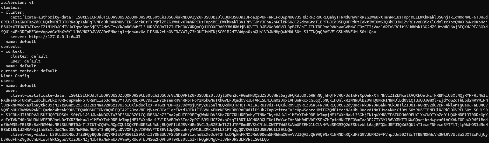

## yaml review
```
apiVersion: v1                       # 이 리소스의 API 그룹/버전. Namespace는 core(v1)에 속함.
kind: Namespace                      # 만들 리소스 종류: 네임스페이스(논리적 격리 단위)
metadata:                            # 리소스 메타정보(이름/라벨/어노테이션 등)
  name: demo-hpa                     # 네임스페이스 이름. 이후 리소스들이 이 공간 안에 생성됨.

---
apiVersion: apps/v1                  # Deployment는 apps API 그룹의 v1을 사용
kind: Deployment                     # 만들 리소스 종류: Deployment (ReplicaSet을 통해 Pod 복제/롤링업데이트 관리)
metadata:
  name: nginx                        # Deployment 이름(네임스페이스 내 유일)
  namespace: demo-hpa                # 이 Deployment가 생성될 네임스페이스 지정 (없으면 default)
spec:                                # Deployment의 “원하는 상태(desired state)” 정의
  replicas: 2                        # 원하는 Pod 개수(초기값). HPA가 붙으면 이 값은 “기본”이고 실제는 HPA가 조정.
  selector:                          # 이 Deployment가 어떤 Pod를 “자기 것”으로 관리할지 선택 규칙
    matchLabels:                     # 라벨 매칭 방식(가장 흔함)
      app: nginx                     # 라벨 app=nginx 인 Pod를 이 Deployment가 관리(ReplicaSet 포함)
  template:                          # Deployment가 생성할 Pod의 템플릿(설계도)
    metadata:
      labels:                        # Pod에 붙일 라벨(서비스 셀렉터/디플로이 셀렉터와 일치해야 함)
        app: nginx                   # Pod 라벨. 위 selector.matchLabels 와 반드시 논리적으로 일치해야 함(불일치 시 오류/예상치 못한 동작).
    spec:                            # Pod 스펙(컨테이너/볼륨/노드스케줄링 등)
      containers:                    # Pod 안에서 실행될 컨테이너 목록(대부분 1개, sidecar면 여러 개)
      - name: nginx                  # 컨테이너 이름(해당 Pod 내에서 유일)
        image: nginx:1.27-alpine     # 사용할 컨테이너 이미지(태그 포함). Alpine 기반이라 가볍고 빠름.
        ports:
        - containerPort: 80          # 컨테이너 내부에서 listen 하는 포트 “정보”. (Service의 targetPort와 연결될 가능성이 큼)
                                     # 주의: 이 설정만으로 방화벽/노출이 되는 건 아니고, “메타 정보”에 가까움.

        # HPA는 requests를 기준으로 CPU Utilization(%) 계산
        resources:                   # 리소스 요청/제한을 설정(스케줄링/제한/오토스케일 기준에 영향)
          requests:                  # "요청(request)" = 이 컨테이너가 최소 이만큼은 필요하다고 선언
            cpu: "50m"               # 50 millicore = 0.05 vCPU. 
                                     # 스케줄러는 노드의 allocatable에서 requests 합을 보고 배치함.
                                     # HPA의 CPU Utilization(%) 계산에서 분모가 되는 기준이 됨(아래 설명).
            memory: "64Mi"           # 메모리 최소 요구량 64MiB. 스케줄링 시 이만큼 자리 필요.
          limits:                    # "제한(limit)" = 컨테이너가 최대 이 이상 쓰지 못하게 제한(강제)
            cpu: "300m"              # CPU 최대 0.3 vCPU 정도로 제한. 초과 사용 시 throttling(쓰로틀링) 발생.
            memory: "128Mi"          # 메모리 최대 128MiB. 초과 시 OOMKilled(강제 종료)될 수 있음.

---
apiVersion: v1                       # Service는 core(v1)
kind: Service                        # 만들 리소스 종류: Service (Pod 집합에 대한 안정적 가상 IP/이름 제공)
metadata:
  name: nginx-svc                    # 서비스 이름 (DNS: nginx-svc.demo-hpa.svc.cluster.local)
  namespace: demo-hpa                # 서비스가 속할 네임스페이스
spec:
  selector:                          # 어떤 Pod들을 이 서비스의 엔드포인트로 묶을지
    app: nginx                       # 라벨 app=nginx 인 Pod들이 대상(Deployment가 만든 Pod와 일치)
  ports:
  - port: 80                         # Service가 클러스터 내부에서 제공하는 포트(클라이언트는 이 포트로 접속)
    targetPort: 80                   # 실제 Pod(컨테이너)로 전달되는 포트(보통 containerPort와 동일)
                                     # (명시 안 하면 port와 동일하다고 간주)

---
apiVersion: autoscaling/v2           # HPA v2 API. behavior, multiple metrics 등 고급 설정 가능.
kind: HorizontalPodAutoscaler        # 만들 리소스 종류: HPA (수평 확장: Pod 개수 조절)
metadata:
  name: nginx-hpa                    # HPA 이름
  namespace: demo-hpa                # HPA가 적용될 네임스페이스(대상 Deployment와 동일해야 함)
spec:
  scaleTargetRef:                    # “어떤 대상”의 replicas를 조절할지 참조
    apiVersion: apps/v1              # 대상 리소스의 API 버전
    kind: Deployment                 # 대상 리소스 종류
    name: nginx                      # 대상 리소스 이름(= 위 Deployment nginx)
  minReplicas: 2                     # 최소 Pod 개수. replicas가 이보다 내려가지 않게 보장(가용성/HA 관점)
  maxReplicas: 4                     # 최대 Pod 개수. 무한 확장 방지(비용/안정성)
  metrics:                           # 오토스케일 판단에 사용할 지표 목록(복수 가능)
  - type: Resource                   # 리소스 기반 지표(CPU/Memory 등). (Pod 지표, External 지표 등도 가능)
    resource:
      name: cpu                      # 측정할 리소스: cpu
      target:
        type: Utilization            # “사용률(%)” 기반 목표
        averageUtilization: 50       # 목표: 평균 CPU 사용률을 50%로 맞추도록 Pod 수 조절
                                     # 여기서 50%는 "requests.cpu"를 기준으로 계산됨.
                                     # 예) requests=50m 인 Pod가 실제 25m 쓰면 utilization=50%
                                     # 예) 60m 쓰면 utilization=120% (요청치보다 많이 쓰는 상태)

  behavior:                          # 스케일 업/다운의 “속도/안정화” 정책 (v2의 핵심 고급 기능)
    scaleUp:                         # Pod를 늘릴 때(확장) 정책
      stabilizationWindowSeconds: 0  # 확장 시 “안정화 창” 0초 = 즉시 반영(가장 공격적인 확장)
                                     # (안정화 창은 최근 권고치들을 보고 급격한 변동을 완화)
      policies:                      # 확장 속도를 제한하는 규칙들(여러 개 가능)
      - type: Pods                   # 절대값 기준 정책
        value: 2                     # 한 번의 스케일 이벤트에서 최대 +2 Pod까지 증가 허용
        periodSeconds: 15            # 이 정책이 적용되는 기간(15초 단위로 평가)
      - type: Percent                # 비율 기준 정책
        value: 100                   # 한 번의 스케일 이벤트에서 현재 replicas의 최대 100%까지 증가 허용
                                     # 예) 현재 2개면 +2까지(=100% 증가)
                                     # 예) 현재 3개면 +3까지 허용하지만 maxReplicas=4 때문에 실제는 +1까지만 가능
        periodSeconds: 15            # 15초 단위
      selectPolicy: Max              # 여러 policies가 동시에 있을 때 “더 크게 늘릴 수 있는” 정책을 선택
                                     # 즉, Pods(+2) vs Percent(+100%) 중 더 큰 증가폭 허용을 채택.
                                     # 이 설정은 “부하 급증에 빨리 대응”하려는 공격적 확장 성향.
```
---
### apps라는 ‘API 그룹(API Group)’**이 Kubernetes에 있고, 그 그룹 안에 Deployment 같은 리소스 타입(kind) 이 들어있다는 뜻이에요.
```
정리하면:
apiVersion: apps/v1

apps = API 그룹 이름
v1 = 그 API 그룹의 버전

kind: Deployment
Deployment라는 리소스 타입(Kind) 을 만들겠다

즉, Kubernetes가 제공하는 건 이렇게 계층이 있어요:
```
---
#### 1) API 그룹 / 버전

v1 (core group) : Namespace, Pod, Service, ConfigMap 같은 것들
core는 그룹명이 생략돼서 그냥 v1처럼 보임
apps/v1 : Deployment, ReplicaSet, StatefulSet, DaemonSet 등
batch/v1 : Job, CronJob
networking.k8s.io/v1 : Ingress, NetworkPolicy
rbac.authorization.k8s.io/v1 : Role, ClusterRole 등

#### 2) 리소스 타입(Kind)
각 그룹/버전 아래에 실제 “종류”가 존재합니다.
예: apps/v1 아래에 Deployment, ReplicaSet, StatefulSet…
##### 왜 이렇게 나눠놨나?
기능 영역별로 API를 묶고(확장/관리 쉬움)
버전(v1, v1beta1 등)로 안정성/호환성 관리
CRD 같은 확장도 “그룹/버전” 형태로 추가 가능
```
---
```sh
ubuntu@cp1:~$ kubectl api-resources | head
NAME                                SHORTNAMES   APIVERSION                          NAMESPACED   KIND
bindings                                         v1                                  true         Binding
componentstatuses                   cs           v1                                  false        ComponentStatus
configmaps                          cm           v1                                  true         ConfigMap
endpoints                           ep           v1                                  true         Endpoints
events                              ev           v1                                  true         Event
limitranges                         limits       v1                                  true         LimitRange
namespaces                          ns           v1                                  false        Namespace
nodes                               no           v1                                  false        Node
persistentvolumeclaims              pvc          v1                                  true         PersistentVolumeClaim
```
### `kubectl api-resources | head` 문장 설명

`kubectl api-resources | head` 는 **“kubectl 출력 결과(텍스트)를 Linux의 `head`로 앞부분만 잘라서 본다”** 는 뜻입니다.  
즉, **Kubernetes 명령 + 리눅스 파이프/필터 명령**이 한 줄에 섞인 대표 패턴입니다.

---

#### 1) 각 토큰(단어) 역할 분해

#### ✅ Kubernetes 쪽: `kubectl api-resources`
- Kubernetes API 서버가 제공하는 **리소스 목록**(Pod, Service, Deployment 같은 “종류들”)을 표 형태로 출력합니다.
- 내부적으로는 “API에 어떤 리소스들이 등록돼 있는지”를 조회해 보여주는 명령입니다.

#### ✅ Linux 쪽: `|` 와 `head`
- **`|` (파이프)**  
  왼쪽 명령의 “출력(stdout)”을 오른쪽 명령의 “입력(stdin)”으로 넘겨줍니다.
- **`head`**  
  입력된 텍스트의 **앞 N줄만 출력**합니다.  
  옵션이 없으면 보통 **기본 10줄**을 출력합니다.

---

#### 2) 전체 문장은 무슨 의미?
- `kubectl api-resources` 출력은 리소스가 많아 **줄이 아주 길어질 수** 있습니다.
- 그래서 그 중 **맨 위 10줄만 빠르게 미리보기** 하겠다는 뜻입니다.

보통 첫 줄은 헤더(예: `NAME SHORTNAMES APIVERSION NAMESPACED KIND`)가 나오고,  
그 아래로 리소스들이 쭉 나옵니다. `head`가 그 중 앞부분만 잘라 보여줍니다.

---

#### 3) 자주 쓰는 변형

- **앞 20줄 보기**
  ```sh
  kubectl api-resources | head -n 20
  ```

- **헤더 제외하고 10줄 보기**
  ```sh
  kubectl api-resources | tail -n +2 | head
  ```
  - `tail -n +2` 도 **리눅스 명령**이며, 2번째 줄부터 출력(=첫 줄 헤더 제거)하는 패턴입니다.
---


```
ubuntu@cp1:~$ kubectl api-resources | grep -i deployment
deployments                         deploy       apps/v1                             true         Deployment
ubuntu@cp1:~$
```
### `kubectl api-resources | grep -i deployment` 문장 설명

`kubectl api-resources | grep -i deployment` 는 **“클러스터가 제공하는 리소스 목록에서 ‘deployment’가 들어간 줄만(대소문자 무시하고) 걸러서 본다”** 는 뜻입니다.  
즉, **Kubernetes 출력 + Linux 텍스트 필터링** 조합입니다.

---

#### 1) 각 토큰(단어) 역할 분해

#### ✅ Kubernetes 쪽: `kubectl api-resources`
- API 서버가 제공하는 **리소스 종류 목록**을 표로 출력합니다.  
  (예: pods, services, deployments, replicasets …)

#### ✅ Linux 쪽: `| grep -i deployment`
- **`|` (파이프)**: 왼쪽 출력(stdout)을 오른쪽 입력(stdin)으로 전달
- **`grep`**: 입력 텍스트에서 **패턴이 포함된 줄만 출력**
- **`-i`**: 대소문자 무시 (Deployment / deployment / DEPLOYMENT 모두 매칭)
- **`deployment`**: 찾고 싶은 키워드(패턴)

---

#### 2) 전체 문장이 하는 일
- `kubectl api-resources` 전체 목록은 너무 길 수 있으니,
- 그중에서 **Deployment 관련 줄만 빠르게 찾는 용도**입니다.

예를 들어 보통 이런 줄이 잡힙니다(환경에 따라 조금 다름):

- `deployments  deploy  apps/v1  true  Deployment`

즉,
- **deployments**: 리소스 “이름”(복수형)
- **deploy**: 짧은 별칭(shortname)
- **apps/v1**: API 그룹/버전
- **true**: 네임스페이스 리소스인지 여부
- **Deployment**: Kind(리소스 타입 이름)

---
---

### vi에서 클립보드 내용을 “깨지지 않게” 정확히 붙여넣기

#### 가장 안전: paste 모드
1) `Esc` → `:set paste` → Enter  
2) `i` (입력) → 붙여넣기  
3) 완료 후 `Esc` → `:set nopaste` → Enter

상태 확인:
```vim
:set paste?
```
#### `kubectl apply ./deploy.yaml`
- `apply`는 파일을 직접 인자로 받지 않고 **`-f`가 필요**
```sh
kubectl apply -f ./deploy.yaml
```
---
#### linux 명령어 연습
```sh
sed -n '1,30p' ./deploy.yaml
grep -n "apiVersion" ./deploy.yaml
cat -A ./deploy.yaml | sed -n '1,30p'
```
---
## Linux 명령어 연습: 각 명령어 설명

아래 3줄은 **YAML 파일(`deploy.yaml`)** 을 리눅스에서 “내용 확인/검색/숨은 문자 확인” 용도로 자주 쓰는 조합입니다.

---

## 1) `sed -n '1,30p' ./deploy.yaml`

- **의도:** 파일의 **1~30번째 줄만 출력**(미리보기)
- 구성
  - `sed`: 스트림 편집기(입력 텍스트를 줄 단위로 처리)
  - `-n`: 기본 출력(자동 출력)을 **끄는 옵션**
  - `'1,30p'`: **1~30줄 범위**를 `p`(print) 하라
  - `./deploy.yaml`: 대상 파일

✅ 비슷한 대안: `head -n 30 ./deploy.yaml`

---

## 2) `grep -n "apiVersion" ./deploy.yaml`

- **의도:** 파일에서 **"apiVersion" 문자열이 들어간 줄을 찾고**, **줄 번호도 같이 출력**
- 구성
  - `grep`: 패턴(문자열/정규식) 검색
  - `-n`: 매칭된 줄 앞에 **라인 번호**를 붙여서 출력
  - `"apiVersion"`: 찾을 문자열(패턴)
  - `./deploy.yaml`: 대상 파일

✅ 자주 같이 쓰는 옵션
- 대소문자 무시: `grep -ni "apiversion" ./deploy.yaml`
- 주변 줄도 같이 보기: `grep -n -C 2 "apiVersion" ./deploy.yaml` (위아래 2줄 포함)

---

## 3) `cat -A ./deploy.yaml | sed -n '1,30p'`

- **의도:** 파일을 출력하되 **숨은 문자(탭/줄끝/제어문자)를 눈에 보이게 표시**하고, 그 결과를 **1~30줄만** 미리보기
- 구성
  - `cat -A ./deploy.yaml`
    - `cat`: 파일 내용을 그대로 출력
    - `-A`: “보이지 않는 문자”를 표시하는 모드  
      - 줄 끝: `$` 로 표시  
      - 탭: 보통 `^I` 로 표시  
      - 기타 제어문자도 기호로 표시
  - `|`: 파이프로 출력 전달
  - `sed -n '1,30p'`: 앞에서 설명한 것처럼 **1~30줄만 출력**

✅ 왜 유용하냐?
- YAML에서 **탭이 섞였는지**, 줄끝에 이상한 공백/CRLF(`^M`) 같은 게 있는지 찾을 때 도움 됩니다.

> 참고: CRLF 문제(Windows 줄끝)가 있으면 `cat -A`에서 줄 끝에 `^M$`처럼 보일 수 있어요. 이때는 `dos2unix deploy.yaml` 같은 걸로 정리합니다.
---
#### 흔한 원인: BOM/CRLF 제거
```sh
sudo sed -i '1s/^\xEF\xBB\xBF//' ./deploy.yaml
sudo sed -i 's/\r$//' ./deploy.yaml
kubectl apply -f ./deploy.yaml
```
---

## 워커노드에서도 pod 목록 보기


#### `kubectl apply -f -` 로 적용한 YAML은 worker node에 반영되는가?

### 핵심 개념
- `kubectl apply`로 만든 오브젝트(Deployment/Service/HPA 등)는 **API Server에 저장되는 desired state**
- “노드에 반영”은 그 결과 생성되는 **Pod가 어느 노드에 스케줄링/실행되었는지**로 확인

### 확인 방법(가장 빠름)
```sh
kubectl -n demo-hpa get deploy,rs,pod,svc,hpa -o wide
kubectl -n demo-hpa get pod -o wide
kubectl -n demo-hpa describe pod -l app=nginx
```
#### 왜 w1만 보이고 w2는 안 쓰였나?

### 결론
- **replicas=2**이면 Pod가 2개뿐이라, 스케줄러가 **cp1 1개 + w1 1개**로 배치할 수 있음
- w2에 “미반영”이 아니라 **배치할 Pod 수가 적어 w2까지 갈 일이 없었던 것**일 가능성이 큼

### w2가 스케줄링 대상인지 체크
```sh
kubectl get nodes -o wide
kubectl describe node w2 | egrep -n "Unschedulable|SchedulingDisabled|Taints"
```
- `Unschedulable: true`면 `kubectl uncordon w2`
- `Taints: ... NoSchedule`가 있으면 일반 Pod가 못 감

#### w2에 뜨는 걸 확인하려면
- replica를 늘리기:
```sh
kubectl -n demo-hpa scale deploy/nginx --replicas=3
kubectl -n demo-hpa get pod -o wide
```


### worker node(w1)에서 부하 상태/Pod 확인 방법

### A) 클러스터 관점(권장): `kubectl`로 w1에 스케줄된 Pod만 보기
```sh
kubectl get pods -A -o wide --field-selector spec.nodeName=w1
kubectl -n demo-hpa get pods -o wide --field-selector spec.nodeName=w1
```

### 리소스(메트릭 서버 필요):
```sh
kubectl top node w1
kubectl top pods -A --field-selector spec.nodeName=w1
```

### B) 노드 로컬 관점(k3s agent에서도 즉시 가능): `k3s crictl`
k3s는 containerd 기반이라 Docker 대신 아래를 사용:
```sh
sudo k3s crictl pods
```
---
```
ubuntu@w2:~$ sudo k3s crictl pods
[sudo] password for ubuntu:
POD ID              CREATED             STATE               NAME                           NAMESPACE           ATTEMPT             RUNTIME
20dffc8d51a0a       2 hours ago         Ready               my-first-pod                   default             0                   (default)
624b6fe3bf2c2       3 weeks ago         Ready               svclb-traefik-e918a231-mtwlj   kube-system         0                   (default)
```
---
```
sudo k3s crictl ps
sudo k3s crictl stats --no-stream
sudo k3s crictl logs <CONTAINER_ID>
```

### 시스템 부하 체크 리눅스 명령
```sh
uptime
top
free -h
```
---
### 시스템 부하 체크 리눅스 명령어
#### 아래 명령들은 리눅스에서 **현재 시스템 부하(Load), CPU 사용률, 메모리 사용량**을 빠르게 확인할 때 가장 흔히 쓰는 기본 도구입니다.

### `uptime`

### 무엇을 보여주나?
- **현재 시간**
- **시스템 가동 시간(uptime)**
- **로그인 사용자 수**
- **Load Average(부하 평균)**: `1분, 5분, 15분` 평균

예시 출력:
```text
 11:03:21 up 12 days,  3:41,  2 users,  load average: 0.35, 0.40, 0.38
```

### 핵심 포인트: Load Average 해석
- Load는 “CPU가 바쁘다” 뿐 아니라 **실행 중(Runnable) + I/O 대기(대기열)** 까지 포함된 “일감 대기 정도”로 이해하면 쉽습니다.
- 일반적으로 **CPU 코어 수**와 비교해 판단합니다.
  - 예: 4코어 서버에서 Load가 `4.0` 근처면 “코어가 꽉 찬 수준”
  - Load가 코어 수보다 훨씬 크면 “대기열이 길다(병목 가능성)”

> 빠른 팁: CPU 코어 수 확인 → `nproc`

---

### `top`

### 무엇을 보여주나?
- **실시간(주기적으로 갱신)** 으로 시스템 상태를 보여주는 모니터
- 주요 구성
  - **CPU 사용률**(us/sy/ni/id/wa/hi/si/st 등)
  - **메모리/스왑 사용량**
  - **프로세스 목록**(CPU/메모리 많이 쓰는 순 등)

### 자주 보는 항목(요약)
- 상단:
  - `load average`: uptime과 동일한 부하 지표
  - `Tasks`: 프로세스/스레드 상태
  - `%Cpu(s)`: CPU 사용 분해
    - `us`: 사용자 영역 CPU
    - `sy`: 커널 영역 CPU
    - `id`: idle(유휴)
    - `wa`: I/O wait(디스크/네트워크 I/O 대기)
- 중단:
  - `MiB Mem`: 메모리 총량/사용/여유/버퍼캐시
  - `MiB Swap`: 스왑 총량/사용/여유
- 하단:
  - PID별 CPU/MEM 사용량

### 실무 팁(주요 단축키)
- `P`: CPU 사용률 기준 정렬
- `M`: 메모리 사용률 기준 정렬
- `1`: CPU 코어별 사용률 보기 토글
- `k`: 프로세스 종료(kill) (권한 주의)
- `q`: 종료

---

### `free -h`

### 무엇을 보여주나?
- 메모리/스왑의 **전체/사용/여유**를 요약해서 보여줍니다.
- `-h` 는 사람이 읽기 쉬운 단위(GiB/MiB)로 표시합니다.

예시 출력:
```text
              total        used        free      shared  buff/cache   available
Mem:           15Gi        3.2Gi       1.1Gi       240Mi        10Gi        11Gi
Swap:         2.0Gi          0B       2.0Gi
```

### 핵심 포인트: `available` 확인
- 리눅스는 성능을 위해 **캐시(buff/cache)** 를 적극적으로 사용합니다.
- 그래서 `free` 값이 작아도 바로 “메모리 부족”이라고 단정하면 안 됩니다.
- 실제로 “프로세스가 추가로 쓸 수 있는 메모리”는 보통 **`available`** 을 기준으로 봅니다.

### 메모리 부족 의심 시 체크
- `available` 이 매우 낮다
- Swap 사용량이 증가한다
- `top`에서 `wa`가 높거나, OOM(Out Of Memory) 관련 로그가 보인다

> OOM 흔적 확인 예: `dmesg | tail -n 50` 또는 `journalctl -k -n 200`

---

## 빠른 한 줄 요약
- **부하 평균**: `uptime`
- **CPU/프로세스 실시간**: `top`
- **메모리 요약**: `free -h`

---

### w1에서 `kubectl`이 localhost:8080으로 붙으면 실패하는 이유/해결

### 증상
w1에서:
```sh
kubectl get pods -A -o wide --field-selector spec.nodeName=w1
```
---
```
ubuntu@w2:~$ kubectl get pods -A -o wide --field-selector spec.nodeName=w1
E0124 02:39:39.935572   17674 memcache.go:265] "Unhandled Error" err="couldn't get current server API group list: Get \"http://localhost:8080/api?timeout=32s\": dial tcp 127.0.0.1:8080: connect: connection refused"
E0124 02:39:39.938115   17674 memcache.go:265] "Unhandled Error" err="couldn't get current server API group list: Get \"http://localhost:8080/api?timeout=32s\": dial tcp 127.0.0.1:8080: connect: connection refused"
E0124 02:39:39.940295   17674 memcache.go:265] "Unhandled Error" err="couldn't get current server API group list: Get \"http://localhost:8080/api?timeout=32s\": dial tcp 127.0.0.1:8080: connect: connection refused"
E0124 02:39:39.942241   17674 memcache.go:265] "Unhandled Error" err="couldn't get current server API group list: Get \"http://localhost:8080/api?timeout=32s\": dial tcp 127.0.0.1:8080: connect: connection refused"
E0124 02:39:39.943629   17674 memcache.go:265] "Unhandled Error" err="couldn't get current server API group list: Get \"http://localhost:8080/api?timeout=32s\": dial tcp 127.0.0.1:8080: connect: connection refused"
The connection to the server localhost:8080 was refused - did you specify the right host or port?
```
#### 위와 같이 실행 시 `localhost:8080 refused` 발생

### 원인
- w1은 **k3s-agent** 노드이고, API Server는 cp1(server)에 있음
- w1에 올바른 kubeconfig가 없으면 `kubectl`이 기본값(=localhost:8080)으로 시도함

### 해결(권장): cp1 kubeconfig를 w1로 복사 후 server 주소를 cp1 IP로 변경
```
ubuntu@w2:~$ cd ~./kube
-bash: cd: ~./kube: No such file or directory
```
---

w1에서(예: cp1 IP가 192.168.56.10인 경우):
```sh
mkdir -p ~/.kube
scp ubuntu@192.168.56.10:/etc/rancher/k3s/k3s.yaml ~/.kube/config
```
---
```
ubuntu@w2:~$ scp ubuntu@192.168.56.10:/etc/rancher/k3s/k3s.yaml ~/.kube/config
The authenticity of host '192.168.56.10 (192.168.56.10)' can't be established.
ED25519 key fingerprint is SHA256:zRAMiX2cfcZyQBYiCwXdqpIMm2jbG9UJrFUs3qFc4hY.
This key is not known by any other names
Are you sure you want to continue connecting (yes/no/[fingerprint])? yes
Warning: Permanently added '192.168.56.10' (ED25519) to the list of known hosts.
ubuntu@192.168.56.10's password:
k3s.yaml 
```
---
```
sudo chown -R $USER:$USER ~/.kube
chmod 600 ~/.kube/config
```
---
---

### `sudo chown -R $USER:$USER ~/.kube` 와 `chmod 600 ~/.kube/config` 설명

## 1) 배경: `~/.kube` 와 `~/.kube/config` 는 무엇인가?

- `~/.kube/` : **kubectl(쿠버네티스 CLI)** 이 참고하는 사용자별 설정 디렉터리입니다.
- `~/.kube/config` : kubectl이 사용할 **클러스터 접속 정보(Kubeconfig)** 가 들어있는 파일입니다.  
  보통 아래 같은 정보가 포함됩니다.
  - API Server 주소
  - 인증서/토큰/키 경로(또는 내용)
  - Context(클러스터/사용자/네임스페이스 조합)

> 이 파일은 사실상 “클러스터 접근 권한”을 담고 있으므로, **권한 설정이 매우 중요**합니다.

---

## 2) `sudo chown -R $USER:$USER ~/.kube` 설명

### 명령어
```sh
sudo chown -R $USER:$USER ~/.kube
```

### 의미
- `sudo` : 관리자 권한으로 실행
- `chown` : 파일/디렉터리의 **소유자(owner)와 그룹(group)** 을 변경
- `-R` : **재귀적으로(Recursive)** `~/.kube` 아래 모든 파일/폴더에 적용
- `$USER:$USER` : 현재 로그인한 사용자 이름을 소유자와 그룹으로 지정  
  예: 사용자가 `ubuntu`이면 `ubuntu:ubuntu`로 설정
- `~/.kube` : 대상 디렉터리

### 왜 쓰나?
- kubeconfig 파일이 **root 소유**로 생성/복사되었거나(예: `sudo kubectl ...`로 실행했다가 생성된 경우),
- 다른 사용자 소유로 되어 있어 **kubectl이 읽지 못하는** 상황에서 해결합니다.

### 확인 방법
```sh
ls -al ~/.kube
ls -al ~/.kube/config
```
- `config` 파일의 소유자가 현재 사용자로 바뀌었는지 확인합니다.

---

## 3) `chmod 600 ~/.kube/config` 설명

### 명령어
```sh
chmod 600 ~/.kube/config
```

### 의미
- `chmod` : 파일/디렉터리의 **권한(permission)** 을 변경
- `600` : 8진수 권한 표기
  - `6`(소유자 owner) = 읽기(4) + 쓰기(2) = **rw-**
  - `0`(그룹 group) = **---**
  - `0`(기타 others) = **---**
- 결과적으로 `~/.kube/config` 는 **소유자만 읽기/쓰기 가능**, 다른 누구도 접근 불가

### 왜 쓰나?
- kubeconfig에는 인증 정보가 들어있어, 권한이 과하게 열려 있으면 보안상 위험합니다.
- 일부 환경/도구는 kubeconfig 권한이 너무 열려 있으면 경고를 띄우거나(예: “world-readable”),
  보안 정책에 의해 접근이 제한될 수 있습니다.

### 확인 방법
```sh
ls -l ~/.kube/config
```
---
- 기대 출력 예: `-rw------- 1 ubuntu ubuntu ... ~/.kube/config`
```
ubuntu@w2:~$ ls -l ~/.kube/config
-rw------- 1 ubuntu ubuntu 2937 Jan 24 02:42 /home/ubuntu/.kube/config
```

---

## 4) 실무에서 자주 겪는 상황 & 팁

### (1) `sudo kubectl ...`를 습관적으로 쓴 경우
- `sudo`로 kubectl을 실행하면, **root 기준으로 kubeconfig가 생성**되거나 접근 경로가 꼬이는 일이 생깁니다.
- 가능하면 kubectl은 **일반 사용자 권한으로** 실행하고,
  필요한 경우에만 `sudo`를 사용하세요.

### (2) 권한을 너무 빡세게 해서 읽지 못하는 경우
- `chmod 600 ~/.kube/config` 는 보통 권장값이지만,
  어떤 자동화 도구가 다른 사용자/그룹으로 접근해야 하는 구조라면 예외가 있을 수 있습니다.
- 그런 경우에는 요구사항에 맞게 `640`(그룹 읽기 허용) 등으로 조정하되,
  **최소 권한 원칙**을 유지하세요.

---

## 5) 한 줄 요약

- `chown -R $USER:$USER ~/.kube` : `~/.kube` 전체를 **내 계정 소유로** 바꿔서 kubectl이 정상 접근하도록 함
- `chmod 600 ~/.kube/config` : kubeconfig를 **내 계정만 읽고/쓸 수 있게** 잠가서 보안 강화

---

### config 파일 보기
```
ubuntu@w2:~$ sudo vi /home/ubuntu/.kube/config
```
---



---
### w1, w2 는 cp 로 경로 변경
```
sed -i 's#https://127.0.0.1:6443#https://192.168.56.10:6443#g' ~/.kube/config
sed -i 's#https://localhost:6443#https://192.168.56.10:6443#g' ~/.kube/config
```
---
### `sed -i 's#https://127.0.0.1:6443#https://192.168.56.10:6443#g' ~/.kube/config` 자세한 설명

## 1) 이 명령이 하는 일 (한 줄 요약)

`~/.kube/config` (kubeconfig) 파일 안에서 **Kubernetes API Server 주소**를

- `https://127.0.0.1:6443` (로컬 루프백)
→ `https://192.168.56.10:6443` (지정한 IP)

로 **일괄 치환(변경)** 합니다.

---

## 2) 배경: 왜 이런 변경이 필요한가?

kubeconfig의 핵심은 “kubectl이 어디로 접속할지(server)” 입니다.

- `127.0.0.1` 는 **현재 명령을 실행하는 머신 자신**을 의미합니다.
  - 즉, `server: https://127.0.0.1:6443` 라면
    - **kubectl을 실행하는 그 머신에 API Server가 떠 있어야** 접속이 됩니다.

### 흔한 상황
- k3s/쿠버네티스 Control Plane이 `192.168.56.10`(예: VirtualBox Host-only/NAT 네트워크) 에 있고
- 지금 `kubectl` 은 다른 머신(예: w2)에서 실행 중인데
- kubeconfig의 server가 `127.0.0.1` 로 되어 있으면

→ w2 입장에서 `127.0.0.1:6443` 는 **w2 자기 자신**이기 때문에, 당연히 접속 실패가 납니다.

그래서 “내가 접속해야 하는 실제 Control Plane의 IP”로 바꿔주는 작업이 필요합니다.

---

## 3) 명령어 구성 요소를 뜯어서 이해하기

### 명령어
```sh
sed -i 's#https://127.0.0.1:6443#https://192.168.56.10:6443#g' ~/.kube/config
```

### 3.1 `sed` 란?
- 텍스트를 **찾고(find) 바꾸는(replace)** 스트림 편집기입니다.
- 설정 파일에서 특정 문자열을 빠르게 치환할 때 자주 씁니다.

### 3.2 `-i` 옵션 (in-place 편집)
- 파일을 **바로 수정**합니다. (출력만 하는 게 아니라 실제 파일 내용이 바뀜)
- GNU sed에서는 `-i`만 쓰면 백업 파일 없이 바로 바꾸고,
- 필요하면 백업 확장자를 줄 수 있습니다.
  - 예: `-i.bak` → 변경 전 파일을 `~/.kube/config.bak` 로 남김

> 실무에서는 실수 대비를 위해 `-i.bak` 형태를 자주 씁니다.

### 3.3 `s#A#B#g` 의미
- `s` : substitute(치환)
- `A` : 찾을 문자열(패턴)
- `B` : 바꿀 문자열
- `g` : 한 줄에 여러 번 나오면 **모두(global)** 바꿈  
  (`g`가 없으면 기본적으로 “각 줄에서 첫 번째만” 바뀝니다)

### 3.4 구분자로 `#` 를 쓰는 이유
sed 치환은 보통 `s/old/new/` 형태지만,
URL에는 `/`가 많아서 이스케이프가 귀찮아집니다.

그래서 아래처럼 구분자로 `#` 를 쓰면 편합니다.
- `s#old#new#g`

> 구분자는 `/`, `#`, `|` 등 무엇이든 가능하지만,  
> URL/경로는 `#`나 `|`가 보통 편합니다.

### 3.5 `~/.kube/config` 는 무엇?
- kubectl이 읽는 kubeconfig 파일
- 그 안에 `clusters:` 항목이 있고, 각 cluster의 `server:` 값이 있습니다.

---

## 4) 실제로 무엇이 바뀌는가? (예시)

### 변경 전(예시)
```yaml
clusters:
- cluster:
    certificate-authority-data: LS0tLS1CRUdJTiBDRVJUSUZJQ0FURS0tLS0t...
    server: https://127.0.0.1:6443
  name: default
```

### 변경 후(예시)
```yaml
clusters:
- cluster:
    certificate-authority-data: LS0tLS1CRUdJTiBDRVJUSUZJQ0FURS0tLS0t...
    server: https://192.168.56.10:6443
  name: default
```

## 즉, kubectl이 API Server에 요청을 보낼 주소가 바뀝니다.

---

## 5) 변경 전/후 확인 방법

### (1) kubeconfig에서 server 값만 확인
```sh
kubectl config view --minify --raw | grep -n "server:"
```
---
```
ubuntu@w2:~$ kubectl config view --minify --raw | grep -n "server:"
5:    server: https://192.168.56.10:6443
```

### (2) 파일 자체에서 확인
```sh
grep -n "server:" ~/.kube/config
```
---
```
ubuntu@w2:~$ grep -n "server:" ~/.kube/config
5:    server: https://192.168.56.10:6443
```
---

### (3) kubectl 동작 확인
```sh
kubectl get nodes
```
---
```
ubuntu@w2:~$ kubectl get nodes
NAME   STATUS   ROLES           AGE   VERSION
cp1    Ready    control-plane   21d   v1.34.3+k3s1
w1     Ready    <none>          21d   v1.34.3+k3s1
w2     Ready    <none>          21d   v1.34.3+k3s1
ubuntu@w2:~$
```
---
```
kubectl cluster-info
```
---
```
ubuntu@w2:~$ kubectl cluster-info
Kubernetes control plane is running at https://192.168.56.10:6443
CoreDNS is running at https://192.168.56.10:6443/api/v1/namespaces/kube-system/services/kube-dns:dns/proxy
Metrics-server is running at https://192.168.56.10:6443/api/v1/namespaces/kube-system/services/https:metrics-server:https/proxy

To further debug and diagnose cluster problems, use 'kubectl cluster-info dump'.
```
---

## 6) 주의사항 (중요)

### 6.1 IP/포트 접속 가능해야 함
- `192.168.56.10:6443` 로 TCP 접속이 가능해야 합니다.
- 방화벽/라우팅/VirtualBox 네트워크 설정에 따라 막힐 수 있습니다.

#### 간단 점검 - 아래의 401 도 무방
```sh
curl -k https://192.168.56.10:6443/healthz
```
```
ubuntu@w2:~$ curl -k https://192.168.56.10:6443/healthz
{
  "kind": "Status",
  "apiVersion": "v1",
  "metadata": {},
  "status": "Failure",
  "message": "Unauthorized",
  "reason": "Unauthorized",
  "code": 401
}
```

- 정상이라면 `ok` 같은 응답이 나올 수 있습니다.
- `-k` 는 인증서 검증을 생략(테스트용)하는 옵션입니다.

### 6.2 인증서(SAN) 문제 가능성
kubeconfig가 `certificate-authority-data` 기반으로 TLS 검증을 하는데,
API Server 인증서에 `192.168.56.10` 이 **SAN(Subject Alternative Name)** 으로 포함되어 있지 않으면,
아래 같은 오류가 날 수 있습니다.

- `x509: certificate is valid for ... not 192.168.56.10`

이 경우 해결책은 보통:
- API Server 인증서를 다시 발급(SAN에 해당 IP 포함)
- 또는 kubeconfig를 올바른 DNS/hostname으로 맞추기
- (권장되지 않지만) 임시로 TLS 검증 우회(운영에선 비추)

k3s에서는 설치 시 `--tls-san` 옵션으로 SAN을 추가할 수 있습니다(환경에 따라 적용 방식 다름).

### 6.3 여러 cluster가 있으면 “의도치 않은” 치환 가능
- kubeconfig에 여러 클러스터가 있고,
  그 중 일부만 바꾸고 싶을 때는 이 명령이 “전체”를 바꿀 수 있습니다.
- 지금 명령은 정확히 `https://127.0.0.1:6443` 문자열만 바꾸므로 비교적 안전하지만,
  그래도 변경 전 백업을 권장합니다.

---

## 7) 더 안전한 실행 방법 (권장)

### 7.1 백업 남기고 수정
```sh
cp ~/.kube/config ~/.kube/config.bak
sed -i 's#https://127.0.0.1:6443#https://192.168.56.10:6443#g' ~/.kube/config
```

### 7.2 `sed -i.bak` 로 자동 백업
```sh
sed -i.bak 's#https://127.0.0.1:6443#https://192.168.56.10:6443#g' ~/.kube/config
```
- 변경 전 파일이 `~/.kube/config.bak` 로 보관됩니다.

---

## 8) 한 줄 요약

- 이 명령은 kubeconfig의 `server:` 주소를 **로컬(127.0.0.1) → 실제 컨트롤플레인 IP(192.168.56.10)** 로 바꿔서,
  **원격 머신에서 kubectl이 클러스터에 붙도록** 만드는 작업입니다.
- 다만, 네트워크 접근성과 인증서 SAN 포함 여부가 함께 충족되어야 정상 동작합니다.

---
```
kubectl get nodes
kubectl get pods -A -o wide --field-selector spec.nodeName=w1
```
---
### 아래에서 w2 에서 cp 처럼 각 서버 정보를 조회
```
ubuntu@w2:~$ kubectl get pods -A -o wide --field-selector spec.nodeName=w2
NAMESPACE     NAME                           READY   STATUS    RESTARTS   AGE   IP          NODE   NOMINATED NODE   READINESS GATES
default       my-first-pod                   1/1     Running   0          5h    10.42.2.9   w2     <none>           <none>
kube-system   svclb-traefik-e918a231-mtwlj   2/2     Running   0          21d   10.42.2.2   w2     <none>           <none>

ubuntu@w2:~$ kubectl get pods -A -o wide --field-selector spec.nodeName=cp1
NAMESPACE              NAME                                                    READY   STATUS         RESTARTS        AGE   IP           NODE   NOMINATED NODE   READINESS GATES
default                nginx-66686b6766-7x2d9                                  1/1     Running        0               21d   10.42.0.9    cp1    <none>           <none>
default                nginx-66686b6766-d4xtt                                  1/1     Running        0               14d   10.42.0.15   cp1    <none>           <none>
default                nginx-66686b6766-frj65                                  1/1     Running        0               13d   10.42.0.19   cp1    <none>           <none>
default                whoami-b85fc56b4-fk6p4                                  1/1     Running        0               13d   10.42.0.18   cp1    <none>           <none>
demo-hpa               hey                                                     0/1     ErrImagePull   0               14d   10.42.0.12   cp1    <none>           <none>
demo-hpa               nginx-c7d5945f8-7c769                                   1/1     Running        0               13d   10.42.0.22   cp1    <none>           <none>
demo-hpa               nginx-c7d5945f8-hh5wg                                   1/1     Running        0               14d   10.42.0.10   cp1    <none>           <none>
kube-system            coredns-7f496c8d7d-bjdjf                                1/1     Running        1 (5h42m ago)   21d   10.42.0.5    cp1    <none>           <none>
kube-system            helm-install-traefik-crd-rjtd8                          0/1     Completed      0               21d   10.42.0.2    cp1    <none>           <none>
kube-system            helm-install-traefik-zxz5t                              0/1     Completed      1               21d   10.42.0.6    cp1    <none>           <none>
kube-system            local-path-provisioner-578895bd58-lp56l                 1/1     Running        0               21d   10.42.0.3    cp1    <none>           <none>
kube-system            metrics-server-7b9c9c4b9c-pw2fz                         1/1     Running        0               21d   10.42.0.4    cp1    <none>           <none>
kube-system            svclb-traefik-e918a231-vc6kg                            2/2     Running        0               21d   10.42.0.7    cp1    <none>           <none>
kube-system            traefik-6f5f87584-lq22d                                 1/1     Running        1 (5h42m ago)   21d   10.42.0.8    cp1    <none>           <none>
kubernetes-dashboard   kubernetes-dashboard-api-6d5bb95b6c-w2xtc               1/1     Running        0               14d   10.42.0.17   cp1    <none>           <none>
kubernetes-dashboard   kubernetes-dashboard-auth-6f886b65cf-txz84              1/1     Running        0               14d   10.42.0.16   cp1    <none>           <none>
kubernetes-dashboard   kubernetes-dashboard-kong-9849c64bd-dfjx2               1/1     Running        0               14d   10.42.0.14   cp1    <none>           <none>
kubernetes-dashboard   kubernetes-dashboard-metrics-scraper-7685fd8b77-vnm6p   1/1     Running        0               13d   10.42.0.20   cp1    <none>           <none>
kubernetes-dashboard   kubernetes-dashboard-web-5c9f966b98-hjw6n               1/1     Running        0               13d   10.42.0.21   cp1    <none>           <none>

ubuntu@w2:~$ kubectl get pods -A -o wide --field-selector spec.nodeName=w1
NAMESPACE     NAME                           READY   STATUS    RESTARTS   AGE   IP          NODE   NOMINATED NODE   READINESS GATES
kube-system   svclb-traefik-e918a231-dfppl   2/2     Running   0          21d   10.42.1.2   w1     <none>           <none>
```
---

## 8) HPA 관련 빠른 체크 포인트

HPA 동작 조건:
- metrics-server 정상
- Pod에 `resources.requests.cpu` 설정(이미 YAML에 포함)

확인:
```sh
kubectl get apiservices | grep metrics
kubectl top nodes
kubectl -n demo-hpa top pods
```
---
```
ubuntu@w2:~$ kubectl -n demo-hpa top pods
NAME                    CPU(cores)   MEMORY(bytes)
nginx-c7d5945f8-7c769   0m           2Mi
nginx-c7d5945f8-hh5wg   0m           2Mi
```
---
```
kubectl -n demo-hpa describe hpa nginx-hpa
```

---
---

### “w1 , w2 에서도 확인”
- kubeconfig 없이도 바로:
```sh
sudo k3s crictl ps
sudo k3s crictl stats --no-stream
```
---
```
ubuntu@w2:~$ sudo k3s crictl ps
CONTAINER           IMAGE               CREATED             STATE               NAME                ATTEMPT             POD ID              POD                            NAMESPACE
d0cea849ae40e       6e2661f396419       5 hours ago         Running             my-first-pod        0                   20dffc8d51a0a       my-first-pod                   default
1f6c76f7380db       f7415d0003cb6       3 weeks ago         Running             lb-tcp-443          0                   624b6fe3bf2c2       svclb-traefik-e918a231-mtwlj   kube-system
ad2663ff1bdd3       f7415d0003cb6       3 weeks ago         Running             lb-tcp-80           0                   624b6fe3bf2c2       svclb-traefik-e918a231-mtwlj   kube-system
```
---

- kubeconfig 세팅 후엔:
```sh
kubectl get pods -A -o wide --field-selector spec.nodeName=w1
kubectl top node w1
```
