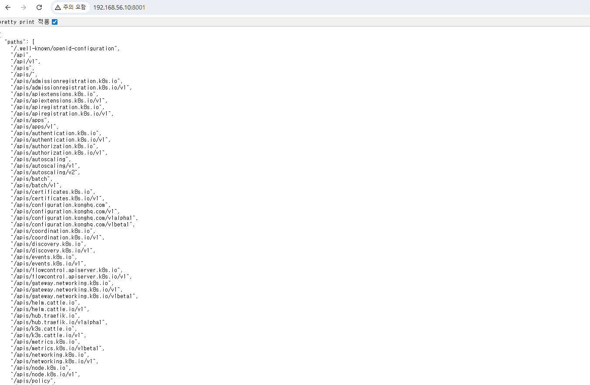

# K3s 노드(w3) NotReady + INTERNAL-IP 오인(중복/아이덴티티 꼬임) 정리

## 1) 관찰된 증상

### (1) cp1에서 본 노드 상태
- `cp1`만 **Ready**
- `w1 / w2 / w3`는 **NotReady**

```
ubuntu@cp1:~$ kubectl get nodes -o wide 
NAME STATUS ROLES AGE VERSION INTERNAL-IP EXTERNAL-IP OS-IMAGE KERNEL-VERSION CONTAINER-RUNTIME 
cp1 Ready control-plane 4d4h v1.34.3+k3s1 192.168.56.10 <none> Ubuntu 22.04.5 LTS 5.15.0-164-generic containerd://2.1.5-k3s1 
w1 NotReady <none> 4d4h v1.34.3+k3s1 192.168.56.11 <none> Ubuntu 22.04.5 LTS 5.15.0-164-generic containerd://2.1.5-k3s1 
w2 NotReady <none> 4d4h v1.34.3+k3s1 192.168.56.12 <none> Ubuntu 22.04.5 LTS 5.15.0-164-generic containerd://2.1.5-k3s1 
w3 NotReady <none> 33m v1.34.3+k3s1 192.168.56.11 <none> Ubuntu 22.04.5 LTS 5.15.0-164-generic containerd://2.1.5-k3s1
```

- 위에서 w1 NotReady <none> 4d4h v1.34.3+k3s1 192.168.56.11 ... 과 w3 NotReady <none> 33m v1.34.3+k3s1 192.168.56.11 동일 
- `kubectl get nodes -o wide`에서 **w3의 INTERNAL-IP가 `192.168.56.11`로 표시**됨  
  → 이 값은 `w1`의 IP와 동일하게 보임 (충돌/오인 가능)

### (2) w3에서 본 실제 네트워크 상태
- `ip -br a` 결과: `enp0s8`가 **`192.168.56.13/24`로 정상**
- `/etc/netplan/*.yaml`도 `192.168.56.13/24`로 설정되어 있음

✅ 결론적으로, **w3 자체 IP는 정상인데 클러스터가 w3를 `192.168.56.11`(w1)로 “착각”**하는 상태로 보임.

---

## 2) 가장 유력한 원인(거의 확정)

### “노드 아이덴티티(식별 정보) 복제/재사용” 또는 “노드 등록 정보 꼬임”
VM을 클론했거나 네트워크/디스크를 복제한 환경에서 아래가 **w1과 동일하게 복제**되면 자주 발생합니다.

- `/etc/hostname` (hostname)
- `/etc/machine-id` (machine-id)
```
cd /etc
ls -al

-r--r--r--  1 root root      33 Jan  1 06:15 machine-id

ubuntu@cp1:/etc$ cat ./machine-id
912972408d93480fbc4263ea5c041eab
```

- k3s agent가 이전 노드의 인증서/상태를 들고 재조인

이 경우, **서버(cp1)가 w3를 새 노드로 인식하지 못하고 기존 노드(w1)의 정체성을 덮어쓰거나 공유**하게 되어,
`kubectl get nodes`에 **IP가 엉뚱하게 표시 + NotReady**가 지속될 수 있습니다.

---

## 3) 원인 확정용 빠른 체크(10초)

w3에서 아래를 실행해 **w1과 동일한지 비교**합니다.

```bash
hostname
cat /etc/hostname
cat /etc/machine-id
cat /var/lib/dbus/machine-id 2>/dev/null || true
```

- hostname이 `w1`로 나오거나
- machine-id가 w1과 동일하면  
→ **100% 복제/아이덴티티 문제**입니다.

---

## 4) 해결(가장 확실): w3를 “깨끗하게 제거 후 재조인(join)”

> 목표: **w3의 hostname + machine-id + k3s agent 상태를 모두 새로** 만들어  
> cp1이 w3를 진짜 “새 노드”로 정상 등록하게 하기

### Step A) cp1에서 w3 노드 삭제
```bash
kubectl delete node w3
```

> (선택) w3가 삭제가 안 되거나 노드 레코드가 꼬였으면, 상황에 따라 w1도 정리 대상이 될 수 있음.

---

### Step B) w3에서 k3s-agent 완전 제거/초기화
```bash
sudo /usr/local/bin/k3s-agent-uninstall.sh
sudo rm -rf /etc/rancher /var/lib/rancher
```

---

### Step C) w3 hostname을 유니크하게 설정
```bash
sudo hostnamectl set-hostname w3
```

---

### Step D) machine-id 재생성(클론 VM에서 핵심)
```bash
sudo rm -f /etc/machine-id /var/lib/dbus/machine-id
sudo systemd-machine-id-setup
sudo reboot
```

---

### Step E) 재부팅 후 w3 재조인(join)

#### 1) cp1에서 토큰 확인
```bash
sudo cat /var/lib/rancher/k3s/server/node-token
```

#### 2) w3에서 agent 설치/실행
(서버 URL은 cp1: `192.168.56.10:6443` 기준)

```bash
curl -sfL https://get.k3s.io |   K3S_URL=https://192.168.56.10:6443   K3S_TOKEN='<위 토큰>'   sh -

sudo systemctl enable --now k3s-agent
```

---

## 5) 정상 복구 확인

cp1에서:

```bash
kubectl get nodes -o wide
```

정상 기준:
- `w3`가 **Ready**
- `w3`의 INTERNAL-IP가 **`192.168.56.13`으로 정확히 표시**

---

## 6) 추가 점검(노드 NotReady / Pod Pending 원인 확인)

### (1) 워커 노드에서 agent 상태/로그 확인
각 워커(w1/w2/w3)에서:

```bash
sudo systemctl status k3s-agent
sudo journalctl -u k3s-agent -n 200 --no-pager
```

### (2) Pod가 Pending/스케줄 실패 확인
cp1에서:

```bash
kubectl get pods -A -o wide | egrep "Pending|Terminating|CrashLoop|demo-hpa|kube-system" -n
kubectl -n demo-hpa get events --sort-by=.lastTimestamp | tail -n 50
```

---

## 7) 핵심 요약(한 줄 결론)

w3의 네트워크/IP 자체 문제라기보다,  
**클러스터가 w3를 w1로 오인하는 “노드 아이덴티티( hostname/machine-id/k3s 상태 ) 꼬임”**이 핵심이며,  
**w3를 완전 초기화 → hostname/machine-id 재생성 → k3s-agent 재조인**이 가장 확실한 해결책입니다.


---
---

# docker run vs kubectl: 동작 방식과 Kubernetes API 목록 확인 방법 정리

> 이 문서는 다음을 정리합니다.

- **docker run**은 왜 “로컬에서 즉시 실행”인지  
- **kubectl**은 왜 “클러스터 API(Server)에 리소스를 요청”하는 것인지  
- kubectl 실행 시 **Kubernetes API Server가 제공하는 API(리소스/엔드포인트/스키마)** 를 **목록으로 확인하는 방법**

---

## 1) docker run은 “로컬 엔진”에 직접 명령

### 명령을 받는 대상
- 내 PC/서버의 **Docker Engine(dockerd)**

### docker run이 하는 일(로컬에서 즉시 수행)
- 이미지 pull(필요 시)  
- 컨테이너 생성  
- 컨테이너 실행  
- 로컬 프로세스/네임스페이스/네트워크 등을 Docker가 직접 관리

✅ 결론: **docker run은 “내 머신에서 바로 실행”** 입니다.

---

## 2) kubectl은 “클러스터 API”에 리소스를 요청하는 클라이언트

# kubectl이 명령을 보내는 대상
- **Kubernetes API Server**

### kubectl run/create/apply가 하는 일(본질)
- “Pod/Deployment 같은 Kubernetes 리소스(선언)를 만들어줘” 라는 **API 요청**

### 그 다음 실제 실행 흐름(클러스터 내부)
1. (API Server) 요청을 받아 리소스 오브젝트를 저장/관리  
2. (컨트롤러) 원하는 상태를 맞추기 위해 ReplicaSet/Pod 등을 생성/조정  
3. (스케줄러) Pod를 실행할 Node를 선택  
4. (kubelet) 해당 Node에서 Pod 실행 지시를 받고 처리  
5. (컨테이너 런타임: containerd/CRI-O 등) 실제 컨테이너를 실행

### kubelet -> Readme.md 파일에서 다시 확인

✅ 결론: **kubectl은 컨테이너를 직접 실행하는 도구가 아니라**  
클러스터에 **“이런 상태로 운영해”** 라고 요청하는 **클라이언트**입니다.

---

## 3) 왜 kubectl run이 docker run처럼 보이나?

- 초기 학습/테스트 편의로 `kubectl run nginx --image=nginx` 같은 UX를 제공
- 하지만 이는 “컨테이너를 로컬에서 즉시 실행”이 아니라  
  **Pod/Deployment 생성 요청(선언)** 입니다.

---

## 4) 구현 언어(오해 정리)

- **kubectl**: Kubernetes 공식 CLI, **Go 언어** 기반
- Docker CLI/생태계도 Go 중심 컴포넌트가 많음
- 즉, “kubectl이 파이썬으로 docker run을 개조한 것”이 아닙니다.

---

## 5) 한 줄 비교

- **docker run** = 로컬 런타임에 즉시 실행  
- **kubectl run/apply** = API Server에 리소스 생성 요청 → 컨트롤러/스케줄러/kubelet이 실행

---

# Kubernetes API Server의 API “목록” 보는 방법

“목록”은 크게 두 종류가 있습니다.

1) **쿠버네티스가 제공하는 리소스(API 오브젝트) 목록**  
2) **API Server가 실제로 노출하는 HTTP 엔드포인트 경로(/api, /apis …) 목록**

---

## A. 쿠버네티스 리소스(API 오브젝트) 목록 보기

### 1) 전체 리소스 목록
```sh
kubectl api-resources
```
- `pods`, `services`, `deployments` 같은 리소스 이름
- `GROUP`(예: apps), `VERSION`(예: v1), `KIND`(예: Deployment)
- Namespaced 여부도 함께 표시

### 2) 특정 API 그룹만 보기 (예: apps)
```sh
kubectl api-resources --api-group=apps
```
```
ubuntu@cp1:/etc$ kubectl api-resources --api-group=apps
NAME                  SHORTNAMES   APIVERSION   NAMESPACED   KIND
controllerrevisions                apps/v1      true         ControllerRevision
daemonsets            ds           apps/v1      true         DaemonSet
deployments           deploy       apps/v1      true         Deployment
replicasets           rs           apps/v1      true         ReplicaSet
statefulsets          sts          apps/v1      true         StatefulSet
```

### 3) 지원하는 API 버전 목록
```sh
kubectl api-versions
```
```
ubuntu@cp1:/etc$ kubectl api-versions
admissionregistration.k8s.io/v1
apiextensions.k8s.io/v1
apiregistration.k8s.io/v1
apps/v1
authentication.k8s.io/v1
authorization.k8s.io/v1
autoscaling/v1
autoscaling/v2
batch/v1
certificates.k8s.io/v1
configuration.konghq.com/v1
configuration.konghq.com/v1alpha1
configuration.konghq.com/v1beta1
coordination.k8s.io/v1
discovery.k8s.io/v1
events.k8s.io/v1
flowcontrol.apiserver.k8s.io/v1
gateway.networking.k8s.io/v1
gateway.networking.k8s.io/v1beta1
helm.cattle.io/v1
hub.traefik.io/v1alpha1
k3s.cattle.io/v1
metrics.k8s.io/v1beta1
networking.k8s.io/v1
node.k8s.io/v1
policy/v1
rbac.authorization.k8s.io/v1
resource.k8s.io/v1
scheduling.k8s.io/v1
storage.k8s.io/v1
traefik.io/v1alpha1
v1
```

---

## B. API Server의 “실제 HTTP API 경로” 목록 보기

> `kubectl get --raw`는 API Server에 raw 요청을 보내고 JSON을 그대로 받습니다.

### 1) 코어 API 루트 (legacy core)
```sh
kubectl get --raw /api
```
```
ubuntu@cp1:/etc$ kubectl get --raw /api
{"kind":"APIVersions","versions":["v1"],"serverAddressByClientCIDRs":[{"clientCIDR":"0.0.0.0/0","serverAddress":"192.168.56.10:6443"}]}
```

### CP 에서 API 서버로서 Swagger 로 보기
```sh
kubectl proxy --address='0.0.0.0' --port=8001 --accept-hosts='^.*$'
```
```
ubuntu@cp1:/etc$ kubectl proxy --address='0.0.0.0' --port=8001 --accept-hosts='^.*$'
Starting to serve on [::]:8001
```
### 위와 같이 웹 데몬 실행 중이고, 웹 브라우저로 접속


---
---
## 나의 PC 호스트에서 해당 json 다운로드

---

```sh
c:\temp 등의 간단히 디렉토리 생성 후
curl.exe -s http://192.168.56.10:8001/openapi/v2 -o openapi.json
```
---

```sh
PS C:\temp> ls
    디렉터리: C:\temp
Mode                 LastWriteTime         Length Name
----                 -------------         ------ ----
-a----      2026-01-23   오후 3:31        3543638 openapi.json
```
---
### Docker 로 올려 보기 - 파워셸에서 실행
```sh
docker run --rm -p 8088:8080 `
  -e SWAGGER_JSON=/spec/openapi.json `
  -v "${PWD}\openapi.json:/spec/openapi.json:ro" `
  swaggerapi/swagger-ui
```
---
### 내 PC 에서 띄운 컨테이너 이므로 브라우저에서 http://127.0.0.1:8088/ 으로 볼것. 단, 실시간 데이타가 아닌 json 의 파싱 형태임


### 2) API 그룹 목록
```sh
kubectl get --raw /apis
```

### 3) 특정 그룹의 버전 보기 (예: apps)
```sh
kubectl get --raw /apis/apps
```

### 4) 특정 그룹/버전의 리소스 보기 (예: apps/v1)
```sh
kubectl get --raw /apis/apps/v1
```

📌 `/apis/apps/v1` 출력 JSON에는 `resources` 배열이 있고  
그 안에 `deployments`, `replicasets` 등 리소스 경로가 나옵니다.

---
---


## C. OpenAPI 스펙으로 “전체 API 스키마” 받기

### OpenAPI v2 스키마 저장
```sh
kubectl get --raw /openapi/v2 > openapi.json
ls -al openapi.json
```
---
```sh
ubuntu@w2:~$ kubectl get --raw /openapi/v2 > openapi.json
ubuntu@w2:~$ ls -al
total 3492
drwxr-x--- 5 ubuntu ubuntu    4096 Jan 24 06:09 .
drwxr-xr-x 3 root   root      4096 Jan  1 06:28 ..
-rw------- 1 ubuntu ubuntu     335 Jan 24 02:07 .bash_history
-rw-r--r-- 1 ubuntu ubuntu       0 Jan  6  2022 .bash_logout
-rw-r--r-- 1 ubuntu ubuntu       0 Jan  6  2022 .bashrc
drwx------ 2 ubuntu ubuntu    4096 Jan  1 06:31 .cache
drwxrwxr-x 3 ubuntu ubuntu    4096 Jan 24 05:58 .kube
-rw-r--r-- 1 ubuntu ubuntu       0 Jan  6  2022 .profile
drwx------ 2 ubuntu ubuntu    4096 Jan 24 02:42 .ssh
-rw-r--r-- 1 ubuntu ubuntu       0 Jan  3 01:44 .sudo_as_admin_successful
-rw------- 1 ubuntu ubuntu     725 Jan 24 05:54 .viminfo
-rw-rw-r-- 1 ubuntu ubuntu 3543638 Jan 24 06:09 openapi.json
```

### (가능하면) OpenAPI v3 확인
```sh
kubectl get --raw /openapi/v3 | head
```
※ 클러스터/권한/버전에 따라 v3 제공 여부가 다를 수 있습니다.

---

## D. kubectl이 “실제로 어떤 URL을 호출했는지” 로그로 보기

```sh
kubectl -v=8 get pods -A
kubectl -v=8 get deploy -A
```


- 출력에 `GET https://.../api/v1/...` 또는 `.../apis/apps/v1/...` 형태로  
  실제 호출 URL/흐름이 보입니다.
- 더 자세히: `-v=9`


---

### k3s 포함 “내 클러스터에서 API 목록 확인” 추천 커맨드 세트

### 연결 확인
```sh
kubectl cluster-info
kubectl config view --minify
```

### 리소스/버전 목록
```sh
kubectl api-resources
kubectl api-resources --namespaced=true
kubectl api-resources --namespaced=false
kubectl api-resources --api-group=apps
kubectl api-versions
```

### 엔드포인트 트리 확인
```sh
kubectl get --raw /api | head
kubectl get --raw /apis | head
kubectl get --raw /apis/apps | head
kubectl get --raw /apis/apps/v1 | head
```

### 스키마 저장
```sh
kubectl get --raw /openapi/v2 > openapi.json
ls -al openapi.json
```

### 실제 호출 URL 보기
```sh
kubectl -v=8 get pods -A
kubectl -v=8 get deploy -A
```

### 리소스 스펙 필드 구조 확인
```sh
kubectl explain deployment
kubectl explain deployment.spec
kubectl explain deployment.spec.template.spec.containers
```

---

## 참고: “목록”을 보는 목적에 따른 빠른 선택

- **리소스 타입(Kind) 뭐 있나?** → `kubectl api-resources`
- **API 그룹/버전 뭐 지원하나?** → `kubectl api-versions`
- **API Server의 실제 REST 경로 트리?** → `kubectl get --raw /api`, `/apis`
- **전체 API 스키마(필드까지) 받고 싶다** → `/openapi/v2`

- **kubectl이 실제로 때린 URL 보고 싶다** → `kubectl -v=8 ...`
### 위의 내용 예시
```
ubuntu@cp1:/etc$ kubectl -v=8 get nodes -o wide
I0126 07:15:48.185193   48885 loader.go:402] Config loaded from file:  /etc/rancher/k3s/k3s.yaml
I0126 07:15:48.210139   48885 helper.go:113] "Request Body" body=""
I0126 07:15:48.213159   48885 round_trippers.go:527] "Request" verb="GET" url="https://127.0.0.1:6443/api/v1/nodes?limit=500" headers=<
        Accept: application/json;as=Table;v=v1;g=meta.k8s.io,application/json;as=Table;v=v1beta1;g=meta.k8s.io,application/json
        User-Agent: kubectl/v1.34.3+k3s1 (linux/amd64) kubernetes/48ffa7b
 >
I0126 07:15:48.228665   48885 round_trippers.go:632] "Response" status="200 OK" headers=<
        Audit-Id: 70e26430-ff1d-4f79-813c-75cc16ebac95
        Cache-Control: no-cache, private
        Content-Type: application/json
        Date: Mon, 26 Jan 2026 07:15:48 GMT
        X-Kubernetes-Pf-Flowschema-Uid: fd2e584d-90ae-47c5-9d69-68fb3dd04504
        X-Kubernetes-Pf-Prioritylevel-Uid: 14292c52-4849-40da-a9b7-aaf6acae16c1
 > milliseconds=10
I0126 07:15:48.235903   48885 helper.go:113] "Response Body" body="{\"kind\":\"Table\",\"apiVersion\":\"meta.k8s.io/v1\",\"metadata\":{\"resourceVersion\":\"21764\"},\"columnDefinitions\":[{\"name\":\"Name\",\"type\":\"string\",\"format\":\"name\",\"description\":\"Name must be unique within a namespace. Is required when creating resources, although some resources may allow a client to request the generation of an appropriate name automatically. Name is primarily intended for creation idempotence and configuration definition. Cannot be updated. More info: https://kubernetes.io/docs/concepts/overview/working-with-objects/names#names\",\"priority\":0},{\"name\":\"Status\",\"type\":\"string\",\"format\":\"\",\"description\":\"The status of the node\",\"priority\":0},{\"name\":\"Roles\",\"type\":\"string\",\"format\":\"\",\"description\":\"The roles of the node\",\"priority\":0},{\"name\":\"Age\",\"type\":\"string\",\"format\":\"\",\"description\":\"CreationTimestamp is a timestamp representing the server time when this object was created. It is not guaranteed to be set in happens-before order across separate operations. Clients may not set this value. It is rep [truncated 12279 chars]"
NAME   STATUS                     ROLES           AGE   VERSION        INTERNAL-IP     EXTERNAL-IP   OS-IMAGE             KERNEL-VERSION       CONTAINER-RUNTIME
cp1    Ready                      control-plane   23d   v1.34.3+k3s1   192.168.56.10   <none>        Ubuntu 22.04.5 LTS   5.15.0-164-generic   containerd://2.1.5-k3s1
w1     Ready,SchedulingDisabled   <none>          23d   v1.34.3+k3s1   192.168.56.11   <none>        Ubuntu 22.04.5 LTS   5.15.0-164-generic   containerd://2.1.5-k3s1
w2     Ready                      <none>          23d   v1.34.3+k3s1   192.168.56.12   <none>        Ubuntu 22.04.5 LTS   5.15.0-164-generic   containerd://2.1.5-k3s1
```
---
```
ubuntu@cp1:/etc$ kubectl -v=8 -n kube-system get pods \
  --field-selector=status.phase!=Running \
  -o wide
I0126 07:16:57.153803   48921 loader.go:402] Config loaded from file:  /etc/rancher/k3s/k3s.yaml
I0126 07:16:57.170226   48921 helper.go:113] "Request Body" body=""
I0126 07:16:57.174057   48921 round_trippers.go:527] "Request" verb="GET" url="https://127.0.0.1:6443/api/v1/namespaces/kube-system/pods?fieldSelector=status.phase%21%3DRunning&limit=500" headers=<
        Accept: application/json;as=Table;v=v1;g=meta.k8s.io,application/json;as=Table;v=v1beta1;g=meta.k8s.io,application/json
        User-Agent: kubectl/v1.34.3+k3s1 (linux/amd64) kubernetes/48ffa7b
 >
I0126 07:16:57.183078   48921 round_trippers.go:632] "Response" status="200 OK" headers=<
        Audit-Id: ad97ff41-b1be-42b0-b9b1-1695f4edc45c
        Cache-Control: no-cache, private
        Content-Type: application/json
        Date: Mon, 26 Jan 2026 07:16:57 GMT
        X-Kubernetes-Pf-Flowschema-Uid: fd2e584d-90ae-47c5-9d69-68fb3dd04504
        X-Kubernetes-Pf-Prioritylevel-Uid: 14292c52-4849-40da-a9b7-aaf6acae16c1
 > milliseconds=6
I0126 07:16:57.187844   48921 helper.go:113] "Response Body" body="{\"kind\":\"Table\",\"apiVersion\":\"meta.k8s.io/v1\",\"metadata\":{\"resourceVersion\":\"21798\"},\"columnDefinitions\":[{\"name\":\"Name\",\"type\":\"string\",\"format\":\"name\",\"description\":\"Name must be unique within a namespace. Is required when creating resources, although some resources may allow a client to request the generation of an appropriate name automatically. Name is primarily intended for creation idempotence and configuration definition. Cannot be updated. More info: https://kubernetes.io/docs/concepts/overview/working-with-objects/names#names\",\"priority\":0},{\"name\":\"Ready\",\"type\":\"string\",\"format\":\"\",\"description\":\"The aggregate readiness state of this pod for accepting traffic.\",\"priority\":0},{\"name\":\"Status\",\"type\":\"string\",\"format\":\"\",\"description\":\"The aggregate status of the containers in this pod.\",\"priority\":0},{\"name\":\"Restarts\",\"type\":\"string\",\"format\":\"\",\"description\":\"The number of times the containers in this pod have been restarted and when the last container in this pod has restarted.\",\"priority\":0},{\" [truncated 12600 chars]"
NAME                             READY   STATUS      RESTARTS   AGE   IP          NODE   NOMINATED NODE   READINESS GATES
helm-install-traefik-crd-rjtd8   0/1     Completed   0          23d   10.42.0.2   cp1    <none>           <none>
helm-install-traefik-zxz5t       0/1     Completed   1          23d   10.42.0.6   cp1    <none>           <none>
```
### kubectl describe / kubectl logs / kubectl exec도 URL 확인 가능
```
kubectl -v=8 describe node w3
```
```
kubectl get pods -o wide
kubectl -v=8 exec -it pod/nginx-66686b6766-frj65 -- sh
```
## 주의사항 exec -it 으로 컨테이너의 리눅스에 접속한 상태 이므로, exit 로 빠져 나오거나, 계속 남아 헛돌면, ssh 접속 종료 필요