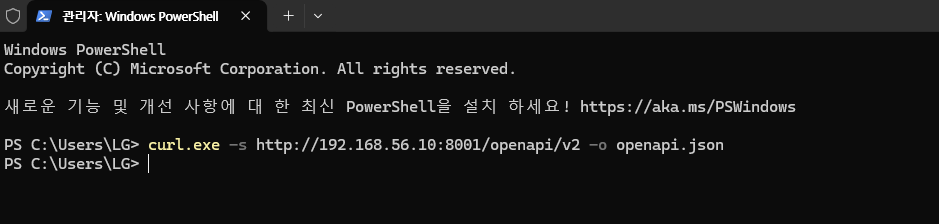
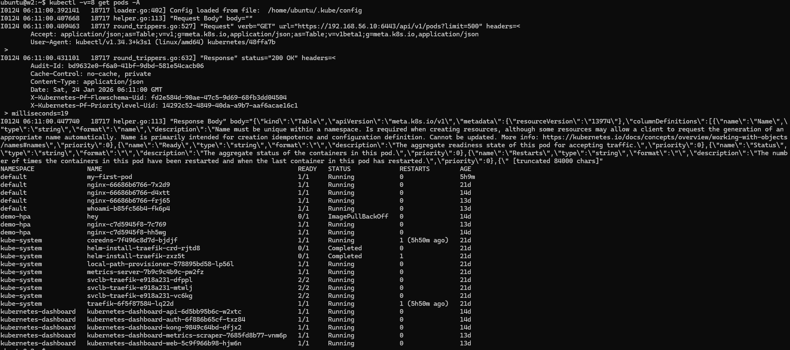

# docker run vs kubectl: 동작 방식과 Kubernetes API 목록 확인 방법 정리

> 이 문서는 다음을 정리합니다.

- **docker run**은 왜 “로컬에서 즉시 실행”인지  
- **kubectl**은 왜 “클러스터 API(Server)에 리소스를 요청”하는 것인지  
- kubectl 실행 시 **Kubernetes API Server가 제공하는 API(리소스/엔드포인트/스키마)** 를 **목록으로 확인하는 방법**

---

## 1) docker run은 “로컬 엔진”에 직접 명령

### 명령을 받는 대상
- 내 PC/서버의 **Docker Engine(dockerd)**

### docker run이 하는 일(로컬에서 즉시 수행)
- 이미지 pull(필요 시)  
- 컨테이너 생성  
- 컨테이너 실행  
- 로컬 프로세스/네임스페이스/네트워크 등을 Docker가 직접 관리

✅ 결론: **docker run은 “내 머신에서 바로 실행”** 입니다.

---

## 2) kubectl은 “클러스터 API”에 리소스를 요청하는 클라이언트

### kubectl이 명령을 보내는 대상
- **Kubernetes API Server**

### kubectl run/create/apply가 하는 일(본질)
- “Pod/Deployment 같은 Kubernetes 리소스(선언)를 만들어줘” 라는 **API 요청**

### 그 다음 실제 실행 흐름(클러스터 내부)
1. (API Server) 요청을 받아 리소스 오브젝트를 저장/관리  
2. (컨트롤러) 원하는 상태를 맞추기 위해 ReplicaSet/Pod 등을 생성/조정  
3. (스케줄러) Pod를 실행할 Node를 선택  
4. (kubelet) 해당 Node에서 Pod 실행 지시를 받고 처리  
5. (컨테이너 런타임: containerd/CRI-O 등) 실제 컨테이너를 실행

✅ 결론: **kubectl은 컨테이너를 직접 실행하는 도구가 아니라**  
클러스터에 **“이런 상태로 운영해”** 라고 요청하는 **클라이언트**입니다.

---

## 3) 왜 kubectl run이 docker run처럼 보이나?

- 초기 학습/테스트 편의로 `kubectl run nginx --image=nginx` 같은 UX를 제공
- 하지만 이는 “컨테이너를 로컬에서 즉시 실행”이 아니라  
  **Pod/Deployment 생성 요청(선언)** 입니다.

---

## 4) 구현 언어(오해 정리)

- **kubectl**: Kubernetes 공식 CLI, **Go 언어** 기반
- Docker CLI/생태계도 Go 중심 컴포넌트가 많음
- 즉, “kubectl이 파이썬으로 docker run을 개조한 것”이 아닙니다.

---

## 5) 한 줄 비교

- **docker run** = 로컬 런타임에 즉시 실행  
- **kubectl run/apply** = API Server에 리소스 생성 요청 → 컨트롤러/스케줄러/kubelet이 실행

---

# Kubernetes API Server의 API “목록” 보는 방법

“목록”은 크게 두 종류가 있습니다.

1) **쿠버네티스가 제공하는 리소스(API 오브젝트) 목록**  
2) **API Server가 실제로 노출하는 HTTP 엔드포인트 경로(/api, /apis …) 목록**

---

## A. 쿠버네티스 리소스(API 오브젝트) 목록 보기

### 1) 전체 리소스 목록
```sh
kubectl api-resources
```
- `pods`, `services`, `deployments` 같은 리소스 이름
- `GROUP`(예: apps), `VERSION`(예: v1), `KIND`(예: Deployment)
- Namespaced 여부도 함께 표시

### 2) 특정 API 그룹만 보기 (예: apps)
```sh
kubectl api-resources --api-group=apps
```

### 3) 지원하는 API 버전 목록
```sh
kubectl api-versions
```
예: `v1`, `apps/v1`, `batch/v1` 등

---

## B. API Server의 “실제 HTTP API 경로” 목록 보기

> `kubectl get --raw`는 API Server에 raw 요청을 보내고 JSON을 그대로 받습니다.

### 1) 코어 API 루트 (legacy core)
```sh
kubectl get --raw /api
```

### CP 에서 API 서버로서 Swagger 로 보기
```sh
kubectl proxy --address='0.0.0.0' --port=8001 --accept-hosts='^.*$'
```
---
### 나의 PC 호스트에서 해당 json 다운로드

---

```sh
c:\temp 등의 간단히 디렉토리 생성 후
curl.exe -s http://192.168.56.10:8001/openapi/v2 -o openapi.json
```
---

```sh
PS C:\temp> ls
    디렉터리: C:\temp
Mode                 LastWriteTime         Length Name
----                 -------------         ------ ----
-a----      2026-01-23   오후 3:31        3543638 openapi.json
```
---
### Docker 로 올려 보기 - 파워셸에서 실행
```sh
docker run --rm -p 8088:8080 `
  -e SWAGGER_JSON=/spec/openapi.json `
  -v "${PWD}\openapi.json:/spec/openapi.json:ro" `
  swaggerapi/swagger-ui
```
---
### 내 PC 에서 띄운 컨테이너 이므로 브라우저에서 http://127.0.0.1:8088/ 으로 볼것. 단, 실시간 데이타가 아닌 json 의 파싱 형태임


### 2) API 그룹 목록
```sh
kubectl get --raw /apis
```

### 3) 특정 그룹의 버전 보기 (예: apps)
```sh
kubectl get --raw /apis/apps
```

### 4) 특정 그룹/버전의 리소스 보기 (예: apps/v1)
```sh
kubectl get --raw /apis/apps/v1
```

📌 `/apis/apps/v1` 출력 JSON에는 `resources` 배열이 있고  
그 안에 `deployments`, `replicasets` 등 리소스 경로가 나옵니다.

---

## C. OpenAPI 스펙으로 “전체 API 스키마” 받기

### OpenAPI v2 스키마 저장
```sh
kubectl get --raw /openapi/v2 > openapi.json
ls -al openapi.json
```
---
```sh
ubuntu@w2:~$ kubectl get --raw /openapi/v2 > openapi.json
ubuntu@w2:~$ ls -al
total 3492
drwxr-x--- 5 ubuntu ubuntu    4096 Jan 24 06:09 .
drwxr-xr-x 3 root   root      4096 Jan  1 06:28 ..
-rw------- 1 ubuntu ubuntu     335 Jan 24 02:07 .bash_history
-rw-r--r-- 1 ubuntu ubuntu       0 Jan  6  2022 .bash_logout
-rw-r--r-- 1 ubuntu ubuntu       0 Jan  6  2022 .bashrc
drwx------ 2 ubuntu ubuntu    4096 Jan  1 06:31 .cache
drwxrwxr-x 3 ubuntu ubuntu    4096 Jan 24 05:58 .kube
-rw-r--r-- 1 ubuntu ubuntu       0 Jan  6  2022 .profile
drwx------ 2 ubuntu ubuntu    4096 Jan 24 02:42 .ssh
-rw-r--r-- 1 ubuntu ubuntu       0 Jan  3 01:44 .sudo_as_admin_successful
-rw------- 1 ubuntu ubuntu     725 Jan 24 05:54 .viminfo
-rw-rw-r-- 1 ubuntu ubuntu 3543638 Jan 24 06:09 openapi.json
```

### (가능하면) OpenAPI v3 확인
```sh
kubectl get --raw /openapi/v3 | head
```
※ 클러스터/권한/버전에 따라 v3 제공 여부가 다를 수 있습니다.

---

## D. kubectl이 “실제로 어떤 URL을 호출했는지” 로그로 보기

```sh
kubectl -v=8 get pods -A
kubectl -v=8 get deploy -A
```


- 출력에 `GET https://.../api/v1/...` 또는 `.../apis/apps/v1/...` 형태로  
  실제 호출 URL/흐름이 보입니다.
- 더 자세히: `-v=9`


---

### k3s 포함 “내 클러스터에서 API 목록 확인” 추천 커맨드 세트

### 연결 확인
```sh
kubectl cluster-info
kubectl config view --minify
```

### 리소스/버전 목록
```sh
kubectl api-resources
kubectl api-resources --namespaced=true
kubectl api-resources --namespaced=false
kubectl api-resources --api-group=apps
kubectl api-versions
```

### 엔드포인트 트리 확인
```sh
kubectl get --raw /api | head
kubectl get --raw /apis | head
kubectl get --raw /apis/apps | head
kubectl get --raw /apis/apps/v1 | head
```

### 스키마 저장
```sh
kubectl get --raw /openapi/v2 > openapi.json
ls -al openapi.json
```

### 실제 호출 URL 보기
```sh
kubectl -v=8 get pods -A
kubectl -v=8 get deploy -A
```

### 리소스 스펙 필드 구조 확인
```sh
kubectl explain deployment
kubectl explain deployment.spec
kubectl explain deployment.spec.template.spec.containers
```

---

## 참고: “목록”을 보는 목적에 따른 빠른 선택

- **리소스 타입(Kind) 뭐 있나?** → `kubectl api-resources`
- **API 그룹/버전 뭐 지원하나?** → `kubectl api-versions`
- **API Server의 실제 REST 경로 트리?** → `kubectl get --raw /api`, `/apis`
- **전체 API 스키마(필드까지) 받고 싶다** → `/openapi/v2`
- **kubectl이 실제로 때린 URL 보고 싶다** → `kubectl -v=8 ...`

