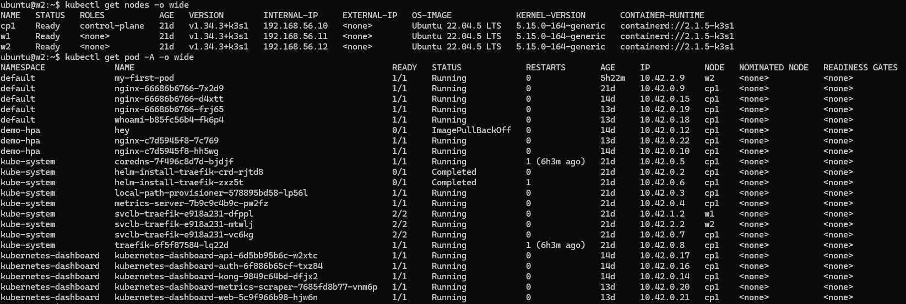

# Kubernetes에서 Pod와 Node의 차이점

## Node, Pod 의 상태 파악 도식화
### 1) Node/Pod 정보 게더링 전체 흐름(아키텍처)

```Mermaid
flowchart LR
  U["User / Operator<br/>kubectl · Dashboard · Scripts"] -->|GET/LIST/WATCH| APIS["Kube-API Server"]
  APIS --> ETCD[("etcd<br/>Cluster State Store")]

  subgraph NODE["Each Node"]
    K3S["k3s/k3s-agent<br/>(includes kubelet)"] -->|CRI| CRI["Container Runtime<br/>containerd/CRI-O"]
    K3S -->|CNI calls| CNI["CNI Plugin<br/>Cilium/Calico/Flannel..."]
    K3S -->|Mount/Attach| CSI["CSI Node Plugin<br/>(if used)"]
  end

  APIS -->|PodSpec / Desired State| K3S
  K3S -->|NodeStatus · PodStatus · Events| APIS

  subgraph METRICS["Metrics Path"]
    MS["metrics-server"] -->|serves| MAPI["Metrics API<br/>metrics.k8s.io"]
    K3S -->|resource summary| MS
    U -->|kubectl top| MAPI
  end

  subgraph OBS["Observability Stack"]
    PROM["Prometheus"] --> GRAF["Grafana"]
    KSM["kube-state-metrics"] --> PROM
    EXP["Node Exporter / app exporters"] --> PROM
    OTEL["OpenTelemetry Collector"] --> TRACE["Jaeger/Tempo"]
    LOGAG["Fluent Bit/Fluentd"] --> LOGS["Loki/ELK/OpenSearch"]
  end

  K3S -->|"/metrics (kubelet/cAdvisor) or exporters"| PROM
  APIS -->|"cluster objects"| KSM
  CRI -->|"container logs"| LOGAG
  U -->|"dashboards/alerts"| GRAF
```


### 2) “게더링 → 분석” 운영 절차(플로우)
```Mermaid
flowchart TD
  S["Start: 이슈/요청 발생"] --> SCOPE["0) 범위/시간대 결정<br/>노드? 네임스페이스? 앱? 최근 1h? 배포 직후?"]
  SCOPE --> H1["1) 전반 상태 체크<br/>nodes/pods/events"]
  H1 -->|이상 없음| H2["추세/성능 문제 가능성<br/>Prometheus/Grafana로 이동"]
  H1 -->|이상 발견| CLASSIFY["2) 증상 분류"]

  CLASSIFY --> PENDING["A) Scheduling 문제<br/>Pending/Unschedulable"]
  CLASSIFY --> CRASH["B) Runtime 문제<br/>CrashLoop/OOM/ImagePull"]
  CLASSIFY --> NET["C) Network/DNS 문제<br/>Service/DNS/NetworkPolicy"]
  CLASSIFY --> RES["D) Resource 압박<br/>CPU/Mem/DiskPressure"]
  CLASSIFY --> AUTH["E) 권한/RBAC 문제<br/>Forbidden/Token/Auth"]

  PENDING --> NODES["3) 노드 드릴다운<br/>describe node · taint · resource"]
  RES --> NODES
  NODES --> NODELOG["노드 로그 확인<br/>k3s/k3s-agent journalctl"]
  NODELOG --> EVIDENCE["5) 근거 수집/시간축 정렬<br/>events+status+logs+metrics"]

  CRASH --> PODS["4) Pod 드릴다운<br/>describe pod · logs · probes"]
  NET --> PODS
  AUTH --> PODS
  PODS --> EVIDENCE

  H2 --> EVIDENCE

  EVIDENCE --> FIX["6) 조치<br/>롤백/설정수정/리소스조정/정책수정"]
  FIX --> VERIFY["검증<br/>상태 정상화 + 재발 모니터링"]
  VERIFY --> END["End: 런북/알람/대시보드 보완"]
```


### 3) 다이어그램과 1:1로 매칭되는 “핵심 수집 명령” (붙여두면 편함)
#### (1) 전반 상태

```
kubectl get nodes -o wide
kubectl get pod -A -o wide
```


---

```
kubectl get events -A --sort-by=.lastTimestamp | tail -n 200
```

### 위의 **events는 리눅스 명령이 아니라 kubectl의 서브커맨드(리소스 타입)**예요.
#### 명령을 분해하면 이렇게 됩니다:
##### kubectl : Kubernetes CLI
##### get : 리소스를 조회하는 동사
##### events : 조회할 Kubernetes 리소스 종류(Event 리소스)
##### -A : 모든 네임스페이스(all namespaces)
##### --sort-by=.lastTimestamp : 출력 결과를 JSON 경로 기준으로 정렬(마지막 타임스탬프)
##### | : 리눅스 파이프(앞 명령 출력 → 뒤 명령 입력)
##### tail -n 200 : 리눅스 명령 tail로 마지막 200줄만 보기
#### 즉, 이 전체 명령에서 **리눅스 자체 명령은 tail과 파이프(|)**이고, events는 Kubernetes의 Event 리소스를 의미합니다.

---

## Kubernetes Event 리소스의 역할

Kubernetes에서 **Event**는 “클러스터에서 일어난 중요한 사실(무슨 일이 있었는지)”을 **짧게 기록해 주는 알림/기록 리소스**입니다.  
주로 **문제 원인 추적(트러블슈팅)** 할 때 가장 먼저 보는 힌트가 됩니다.

---

## 1) Event가 하는 역할

- **Pod/Deployment/Node 등 리소스에 대해 발생한 변화나 실패를 기록**
  - 스케줄링 성공/실패(예: `FailedScheduling`)
  - 이미지 풀 실패(예: `Failed to pull image`)
  - 컨테이너 재시작/크래시(예: `Back-off restarting failed container`)
  - 노드 이상/리소스 부족(예: `NodeNotReady`, `Insufficient cpu`)
  - 볼륨 마운트 실패, 프로브 실패(Readiness/Liveness), 권한 문제 등
- “로그(log)”처럼 긴 내용이 아니라, **요약된 사건/사유 + 관련 오브젝트** 중심
- 특정 오브젝트(`involvedObject`)에 **붙는 형태**라서, `kubectl describe pod ...` 할 때 아래쪽에 **Events**가 같이 나옵니다.

---

## 2) 언제 가장 유용하나

- Pod이 **Pending**에서 안 뜰 때  
  → `FailedScheduling` 이벤트로 이유가 바로 나옵니다(리소스 부족, taint/toleration, 노드 선택 등).
- Pod이 **ImagePullBackOff**일 때  
  → 레지스트리 인증/이미지명 오류/네트워크 문제 단서.
- Pod이 **CrashLoopBackOff**일 때  
  → 프로브 실패, OOMKilled, 시작 실패 등 “왜 반복 재시작인지” 힌트.
- Service/Ingress 연결 문제  
  → 엔드포인트 생성/변경, 컨트롤러가 남긴 이벤트 단서.

---

## 3) Event의 성격(중요한 특징)

- **영구 로그가 아님(짧게 보관됨)**  
  Event는 “최근 상황 파악용”이라 시간이 지나면 자동으로 사라질 수 있습니다(클러스터 설정에 따라 TTL/보관 정책 영향).
- **같은 일이 반복되면 count가 누적**되거나 유사 이벤트가 계속 생성됩니다.
- 일반적인 분석 흐름:  
  **Event로 방향 잡기 → `kubectl logs`로 앱 로그 확인 → 노드/컨트롤 플레인 로그 확인**.

---

## 4) 실무에서 자주 쓰는 조회 명령

```bash
# 전체 네임스페이스 이벤트(최신순 정렬)
kubectl get events -A --sort-by=.lastTimestamp

# 특정 네임스페이스만
kubectl get events -n demo

# 특정 오브젝트 중심으로(Describe에 Events가 붙어서 나옴)
kubectl describe pod <pod-name> -n <ns>

# 문제 이벤트만 대충 필터(문자열 기반)
kubectl get events -A | grep -E "Warning|Failed|BackOff|Error"
```
---
```
ubuntu@w2:~$ kubectl get events -A | grep -E "Warning|Failed|BackOff|Error"
demo-hpa    4m17s       Normal    BackOff   pod/hey   Back-off pulling image "rakyll/hey"
demo-hpa    4m17s       Warning   Failed    pod/hey   Error: ImagePullBackOff
```

---

#### **Event는 “클러스터에서 무슨 일이 일어났는지”를 오브젝트에 붙여서 남기는 “짧은 사건 기록”이고, 장애 분석의 첫 단서입니다.**


```
ubuntu@cp1:~$ kubectl api-resources | grep -i event
events                              ev           v1                                  true         Event
events                              ev           events.k8s.io/v1                    true         Event 결과 설명
```

---

좋아요. 이 출력은 **“Kubernetes에 Event 리소스가 2개의 API 그룹/버전으로 제공되고 있다”**는 뜻입니다. 각 컬럼을 쪼개서 보면 더 명확해요.

출력(열)은 대략 이렇게 구성됩니다:

NAME | SHORTNAMES | APIVERSION | NAMESPACED | KIND

1) 첫 번째 줄
events   ev   v1   true   Event


NAME: events
리소스의 복수형태 s 붙은 이름(=kubectl get events에서 쓰는 이름)

SHORTNAMES: ev
줄여서 kubectl get ev도 가능

APIVERSION: v1
여기서 v1은 **core API group(그룹명 생략)**의 v1을 의미합니다.
즉 “core/v1”이라고 생각하면 되고, core는 관례적으로 그룹명을 안 적습니다.

NAMESPACED: true
Event는 네임스페이스에 속하는 리소스입니다.
그래서 kubectl get events -n demo-hpa처럼 네임스페이스 단위로 조회할 수 있고,
전체를 보려면 -A가 필요합니다.

KIND: Event
Kind 이름은 Event

2) 두 번째 줄
events   ev   events.k8s.io/v1   true   Event


APIVERSION: events.k8s.io/v1
이번엔 core가 아니라, events.k8s.io라는 별도 API 그룹의 v1로도 Event가 제공된다는 뜻입니다.
(동일한 “Event”라는 Kind가 다른 그룹에서도 제공)

나머지(이름/별칭/네임스페이스 여부/Kind)는 동일합니다.

3) 왜 Event가 2개로 보이냐?

요지는 **“Event라는 리소스가 역사적으로 core/v1에도 있었고, 동시에 events.k8s.io 그룹으로도 제공”**되기 때문입니다.
클러스터/버전에 따라 내부 구현·호환성 때문에 둘 다 노출되는 경우가 많습니다.
사용자는 보통 그냥:

kubectl get events


만 써도 되고, kubectl이 적절히 처리합니다.

4) “내가 지금 실제로 어느 API로 보고 있나” 확인 팁

특정 API 그룹을 강제로 쓰고 싶으면(거의 필요 없지만) 이런 식으로 할 수 있습니다.

kubectl get --raw /api/v1/events | head
kubectl get --raw /apis/events.k8s.io/v1/events | head


/api/... 는 core 그룹

/apis/... 는 non-core 그룹

원하면, 지금 쓰신 이벤트 조회 명령(kubectl get events -A --sort-by=.lastTimestamp)에서 정렬 키로 .eventTime을 쓰는 게 더 맞는지, k3s/버전별로 “잘 정렬되는 필드”까지 같이 정리해드릴게요.

그럼 events.k8s.io/v1 의 주소는 실제 k8s.io 로 부터 명령을 실행하고 있다는 건가?

아니요. events.k8s.io/v1에 k8s.io가 들어가도 “인터넷의 k8s.io 사이트로 요청한다”는 뜻이 전혀 아닙니다.
이건 **클러스터 내부 Kubernetes API 서버가 제공하는 “API 그룹 이름”**일 뿐이에요.

왜 k8s.io가 들어가나?

Kubernetes는 API 그룹을 **도메인 형태로 네임스페이스(충돌 방지)**해서 씁니다.

events.k8s.io = “Event 관련 API 그룹 이름”

networking.k8s.io, rbac.authorization.k8s.io 등도 같은 패턴

이 도메인 문자열은 식별자/네임스페이스 역할이고, 실제로 DNS 조회해서 외부로 나가는 주소가 아닙니다.

실제로 어디로 요청하느냐?

kubectl은 항상 내 kubeconfig에 설정된 Kubernetes API Server로 요청합니다.

확인:

kubectl config view --minify --raw | grep server


k3s면 보통 이런 느낌입니다.

로컬: https://127.0.0.1:6443

또는: https://<컨트롤플레인 IP>:6443

API 경로도 “클러스터 내부”입니다

core 그룹: /api/v1/...

non-core 그룹: /apis/<group>/<version>/...

예:

kubectl get --raw /apis/events.k8s.io/v1 | head
kubectl get --raw /apis/events.k8s.io/v1/events | head


이것도 전부 **내 클러스터의 API 서버(6443)**로 가는 요청이에요.

---

### 한 줄 결론
#### events.k8s.io/v1은 외부 k8s.io에 접속한다는 뜻이 아니라, 내 클러스터 API 서버 안에 있는 “events.k8s.io”라는 API 그룹을 쓴다는 의미

#### (3) 특정 노드/파드 드릴다운
```
kubectl describe node <node>
kubectl describe node cp1
```
---
```
kubectl describe pod -n <ns> <pod>
kubectl describe pod -n default whoami-b85fc56b4-75gbn
```
---
```
ubuntu@cp1:~$ kubectl describe pod -n default whoami-b85fc56b4-75gbn
Name:             whoami-b85fc56b4-75gbn
Namespace:        default
Priority:         0
Service Account:  default
Node:             cp1/192.168.56.10
Start Time:       Thu, 22 Jan 2026 07:12:38 +0000
Labels:           app=whoami
                  pod-template-hash=b85fc56b4
Annotations:      <none>
Status:           Running
IP:               10.42.0.14
IPs:
  IP:           10.42.0.14
Controlled By:  ReplicaSet/whoami-b85fc56b4
Containers:
  whoami:
    Container ID:   containerd://034709103eb5a68e607543fa4088f5e890966b73b5455dd6b5e68e4436bd8c7b
    Image:          traefik/whoami
    Image ID:       docker.io/traefik/whoami@sha256:200689790a0a0ea48ca45992e0450bc26ccab5307375b41c84dfc4f2475937ab
    Port:           <none>
    Host Port:      <none>
    State:          Running
      Started:      Thu, 22 Jan 2026 07:12:47 +0000
    Ready:          True
    Restart Count:  0
    Environment:    <none>
    Mounts:
      /var/run/secrets/kubernetes.io/serviceaccount from kube-api-access-4gzrj (ro)
Conditions:
  Type                        Status
  PodReadyToStartContainers   True
  Initialized                 True
  Ready                       True
  ContainersReady             True
  PodScheduled                True
Volumes:
  kube-api-access-4gzrj:
    Type:                    Projected (a volume that contains injected data from multiple sources)
    TokenExpirationSeconds:  3607
    ConfigMapName:           kube-root-ca.crt
    Optional:                false
    DownwardAPI:             true
QoS Class:                   BestEffort
Node-Selectors:              <none>
Tolerations:                 node.kubernetes.io/not-ready:NoExecute op=Exists for 300s
                             node.kubernetes.io/unreachable:NoExecute op=Exists for 300s
Events:
  Type    Reason     Age   From               Message
  ----    ------     ----  ----               -------
  Normal  Scheduled  55m   default-scheduler  Successfully assigned default/whoami-b85fc56b4-75gbn to cp1
  Normal  Pulling    55m   kubelet            Pulling image "traefik/whoami"
  Normal  Pulled     55m   kubelet            Successfully pulled image "traefik/whoami" in 7.008s (7.008s including waiting). Image size: 3039655 bytes.
  Normal  Created    55m   kubelet            Created container: whoami
  Normal  Started    55m   kubelet            Started container whoami
```

---
```
kubectl logs -n <ns> <pod> --tail=300
kubectl logs -n <ns> <pod> --previous --tail=300
```

#### (4) k3s 노드 에이전트 로그(당신 케이스)
#### cp 라면
```
sudo journalctl -u k3s -n 200 --no-pager
```
#### worker 라면
```
sudo journalctl -u k3s-agent -n 200 --no-pager
```
##### systemd로 실행 중인 k3s 서비스의 로그를 최근 200줄만, 페이지 없이 한 번에 출력하는 명령입니다.

```
구성요소별 의미

sudo
시스템 로그는 권한이 필요한 경우가 많아서 관리자 권한으로 실행합니다.

journalctl
systemd journal(저널) 에 저장된 로그를 조회하는 리눅스 명령입니다.
(/var/log/syslog 같은 텍스트 로그가 아니라, systemd가 관리하는 로그 저장소)

-u k3s
unit(서비스) 이름이 k3s인 것만 필터링해서 봅니다.

k3s 서버 노드: 보통 k3s

k3s 에이전트 노드: 보통 k3s-agent

-n 200
최근 200줄만 보여줍니다. (tail처럼)

--no-pager
기본은 less 같은 페이저로 넘겨 보게 되는데,
이 옵션을 주면 스크롤/대기 없이 바로 터미널에 출력합니다.
(파이프 | grep 같은 것과 같이 쓰기에도 편함)

언제 유용하나 (k3s에서)

k3s가 정상 기동했는지 확인

kubelet 역할(노드 에이전트)이 Pod를 왜 못 띄우는지 단서 확인

containerd/CRI 관련 에러, 인증서/토큰 문제, CNI(네트워크) 문제 확인

실무에서 같이 쓰는 변형 예시

실시간 로그 따라가기:

sudo journalctl -u k3s -f


특정 시간 이후 로그:

sudo journalctl -u k3s --since "2026-01-24 09:00:00"


에러/경고만 보고 싶을 때:

sudo journalctl -u k3s -p warning -n 200 --no-pager


에이전트 노드라면:

sudo journalctl -u k3s-agent -n 200 --no-pager

```


## node 실행 파악
```sh
ubuntu@cp1:~$ kubectl get nodes
NAME   STATUS   ROLES           AGE     VERSION
cp1    Ready    control-plane   6h2m    v1.34.3+k3s1
w1     Ready    <none>          5h50m   v1.34.3+k3s1
w2     Ready    <none>          5h47m   v1.34.3+k3s1
```
## Worker Node 실행 중지 후 다음 명령
### 노드가 죽어도 컨트롤플레인이 바로 NotReady로 바꾸지 않고, 일정 시간(헬스체크/하트비트 유예)을 보고 상태를 바꾸는 경우가 흔합니다. 그래서 -w로 보고 있어도 “몇십 초~수 분” 지연이 생길 수 있어요
---
```sh
ubuntu@cp1:~$ kubectl get nodes -w
NAME   STATUS     ROLES           AGE     VERSION
cp1    Ready      control-plane   6h3m    v1.34.3+k3s1
w1     NotReady   <none>          5h51m   v1.34.3+k3s1
w2     NotReady   <none>          5h48m   v1.34.3+k3s1
```


## 1. 기본 개념 비교

| 항목              | Pod                                              | Node (노드)                                          |
|-------------------|--------------------------------------------------|------------------------------------------------------|
| 개념              | Kubernetes의 **가장 작은 배포 단위**              | 클러스터를 구성하는 **실제 워커 머신** (물리/가상 서버) |
| 역할              | 하나 이상의 컨테이너를 실행하는 논리적 그룹        | Pod들을 실제로 실행·관리하는 물리적/가상 인프라         |
| 생성 주체         | 사용자 / Deployment / StatefulSet / Job 등        | 클러스터 관리자 또는 autoscaler가 서버를 추가할 때     |
| 수명 주기         | 매우 짧음 (삭제·재시작·스케일링 시 자주 생성/소멸) | 매우 길음 (서버가 살아있는 동안 지속)                  |
| IP 주소           | Pod마다 고유한 클러스터 내부 IP 할당              | Node 자체도 IP 있음 (Pod IP와 별개)                    |
| 스케줄링 대상     | Kubernetes 스케줄러가 적절한 Node에 배치           | 사람이 직접 추가하거나 kubelet 등록                   |
| 여러 개 실행 가능 | 하나의 Node 위에 **여러 개의 Pod** 동시 실행 가능 | 하나의 클러스터에 **여러 개의 Node** 존재 가능        |
| 장애 시 동작      | Pod 장애 → 컨트롤러가 자동으로 새 Pod 생성         | Node 장애 → 해당 Node의 모든 Pod가 다른 Node로 재배치  |
| 관리 관점         | **애플리케이션** 중심 (Deployment, ReplicaSet 등) | **인프라** 중심 (클러스터 autoscaler, 노드 유지보수)   |
| 대표 명령어       | `kubectl get pods`<br>`kubectl describe pod`     | `kubectl get nodes`<br>`kubectl describe node`        |

## 2. 핵심 차이점 요약 (가장 중요한 3가지)

1. **추상화 수준**  
   - **Pod** : 애플리케이션 레벨의 추상화  
     → 어떤 컨테이너들을 어떻게 같이 실행할 것인가  
   - **Node** : 인프라 레벨의 추상화  
     → 어떤 물리적/가상 서버에 Pod를 올릴 것인가

2. **생명 주기**  
   - **Pod** : 일시적이며 빈번하게 생성·소멸  
     (스케일링, 롤링 업데이트, 장애 복구 등 정상 운영 중에도 자주 발생)  
   - **Node** : 가능한 한 장기간 유지되어야 하는 서버  
     (하드웨어 교체, OS 업그레이드 등으로만 교체됨)

3. **계층 관계**
```
클러스터
├─ Node 1
│     ├─ Pod A (nginx + filebeat)
│     ├─ Pod B (backend-api)
│     └─ Pod C (redis)
├─ Node 2
│     ├─ Pod D (frontend)
│     └─ Pod E (worker)
└─ Node 3
└─ ...
```
text## 3. 실무적 비유
Node  = 건물 (데이터센터의 물리/가상 서버)
Pod   = 건물 안에 입주해 있는 세입자 (실행 중인 애플리케이션)
• 건물(Node)은 최대한 오래 안정적으로 유지·관리
• 세입자(Pod)는 이사(삭제), 새 입주(생성)가 매우 빈번함
text## 4. 실무에서 자주 비교되는 추가 항목

| 항목                        | Pod                                      | Node                                          |
|-----------------------------|------------------------------------------|-----------------------------------------------|
| 리소스 requests/limits      | 적용 (컨테이너 단위)                      | 적용 (kubelet이 Node 전체 리소스 관리)         |
| taints & tolerations        | tolerations 설정                         | taints 설정 (특정 Pod 배치 제한)              |
| node affinity / selector    | Pod에서 Node 선택 조건 설정               | Node 자체에 속성 부여                          |
| 장애 격리 범위              | Pod 단위 (다른 Pod 영향 최소)             | Node 단위 (같은 Node 내 모든 Pod 영향)        |
| autoscaling 대상            | HPA (Horizontal Pod Autoscaler)          | Cluster Autoscaler / Karpenter                |
| 모니터링 포커스             | 애플리케이션/컨테이너 메트릭               | OS, kubelet, 하드웨어, 컨테이너 런타임 메트릭   |

---

### taints & tolerations — tolerations 설정 / taints 설정(특정 Pod 배치 제한) 설명

## 1) taints & tolerations 한 줄 정의
- **Taint(노드에 붙임)**: “이 노드는 아무나 오지 마(특정 조건을 만족한 Pod만 와)”라는 **거부/제한 규칙**
- **Toleration(Pod에 붙임)**: “나(이 Pod)는 그 taint를 **견딜 수 있어**, 저 노드에 배치(또는 유지)해도 돼”라는 **허용 증명서**

즉,
- **Taint = 노드 입장(거절)**
- **Toleration = Pod 입장(예외 허용)**

---

## 2) “taints 설정(특정 Pod 배치 제한)” 설명 (노드 쪽)
### 노드에 taint 추가
```bash
kubectl taint nodes <node-name> dedicated=teamA:NoSchedule
```
의미:
- `<node-name>` 노드에 `dedicated=teamA` 라는 taint를 붙이고,
- `NoSchedule`이므로 **toleration 없는 Pod는 이 노드에 새로 배치 불가**

### taint 제거
```bash
kubectl taint nodes <node-name> dedicated=teamA:NoSchedule-
```

### 현재 taint 확인
```bash
kubectl describe node <node-name> | grep -A3 Taints
```

---

## 3) “tolerations 설정” 설명 (Pod 쪽)
Pod(또는 Deployment) YAML에 tolerations를 추가해 **예외 허용**을 선언합니다.

### 예시 1) 특정 taint를 견디고 배치 허용
```yaml
spec:
  tolerations:
  - key: "dedicated"
    operator: "Equal"
    value: "teamA"
    effect: "NoSchedule"
```
의미:
- 노드 taint가 `dedicated=teamA:NoSchedule`인 경우,
- 이 Pod는 해당 taint를 toleration 하므로 **그 노드에 배치 가능**

### 예시 2) 키만 맞으면 값 상관없이 허용(Exists)
```yaml
spec:
  tolerations:
  - key: "dedicated"
    operator: "Exists"
    effect: "NoSchedule"
```
의미:
- `dedicated` 키가 있는 taint면 값이 뭐든 toleration

---

## 4) (중요) toleration만 있으면 그 노드로 “반드시” 가나?
아니요. **toleration은 ‘갈 수 있다’(허용)일 뿐, ‘반드시 간다’(강제)가 아닙니다.**

“반드시 그 노드로 보내기”까지 원하면 보통 같이 씁니다:
- `nodeSelector`, `nodeAffinity` (Pod를 특정 노드/라벨로 **유도/강제**)
- 또는 특정 노드만 taint를 갖고 있게 만들어 “사실상 그쪽으로만 갈 수 있게” 구성

예)
```yaml
spec:
  nodeSelector:
    node-role: teamA
  tolerations:
  - key: "dedicated"
    operator: "Equal"
    value: "teamA"
    effect: "NoSchedule"
```

---
## 요약 (한 문장)

**Pod**는 애플리케이션 실행 단위를 나타내는 **논리적 개념**이며,  
**Node**는 그 Pod를 실제로 실행하는 **물리적/가상 인프라**입니다.

---

## 쿠버네티스 매니페스트(Manifest) 는 “클러스터에 적용할 리소스 정의서”이고, 보통 YAML 형식으로 작성합니다. 아래는 형식(필수 필드) 과 자주 쓰는 예시들입니다.

### 1) 매니페스트 기본 형식(공통 골격)
```
apiVersion: <리소스가 속한 API 버전>
kind: <리소스 종류>
metadata:
  name: <이름>
  namespace: <네임스페이스>   # 선택 (없으면 default)
  labels:                    # 선택
    app: myapp
spec:                        # 리소스별로 내용이 달라짐
  ...
```
---

```
apiVersion: 예) v1, apps/v1, autoscaling/v2

kind: 예) Pod, Deployment, Service, Ingress, ConfigMap, Secret

metadata.name: 리소스 이름(네임스페이스 내 유니크)

spec: “원하는 상태(Desired State)” 정의
```
---
### 2) 여러 리소스를 한 파일에 넣기 (--- 구분자)
```
apiVersion: v1
kind: Namespace
metadata:
  name: demo
---
apiVersion: v1
kind: ConfigMap
metadata:
  name: demo-config
  namespace: demo
data:
  APP_MODE: "dev"
```
---

적용:
```
kubectl apply -f file.yaml
```

#### Pod 예시(가장 단순)
```
apiVersion: v1
kind: Pod
metadata:
  name: nginx-pod
spec:
  containers:
  - name: nginx
    image: nginx:1.27-alpine
    ports:
    - containerPort: 80
```
#### Deployment 예시(실무 기본, Replica 관리)
```
apiVersion: apps/v1
kind: Deployment
metadata:
  name: nginx
  namespace: demo
spec:
  replicas: 2
  selector:
    matchLabels:
      app: nginx
  template:
    metadata:
      labels:
        app: nginx
    spec:
      containers:
      - name: nginx
        image: nginx:1.27-alpine
        ports:
        - containerPort: 80
        resources:
          requests:
            cpu: "50m"
            memory: "64Mi"
          limits:
            cpu: "300m"
            memory: "128Mi"
```
### Service 예시(파드 앞단 고정 주소)
ClusterIP (클러스터 내부용, 기본)
```
apiVersion: v1
kind: Service
metadata:
  name: nginx-svc
  namespace: demo
spec:
  selector:
    app: nginx
  ports:
  - port: 80
    targetPort: 80

NodePort (노드 IP:포트로 외부 노출)
apiVersion: v1
kind: Service
metadata:
  name: nginx-nodeport
  namespace: demo
spec:
  type: NodePort
  selector:
    app: nginx
  ports:
  - port: 80
    targetPort: 80
    nodePort: 30080   # 보통 30000~32767
```
#### Ingress 예시(k3s 기본 Traefik과 함께 많이 씀)
#### k3s는 Traefik이 기본 Ingress Controller로 들어오는 경우가 많습니다.
```
apiVersion: networking.k8s.io/v1
kind: Ingress
metadata:
  name: nginx-ing
  namespace: demo
spec:
  rules:
  - host: nginx.local
    http:
      paths:
      - path: /
        pathType: Prefix
        backend:
          service:
            name: nginx-svc
            port:
              number: 80
```
### HPA 예시(오토스케일, CPU 기준)
```
apiVersion: autoscaling/v2
kind: HorizontalPodAutoscaler
metadata:
  name: nginx-hpa
  namespace: demo
spec:
  scaleTargetRef:
    apiVersion: apps/v1
    kind: Deployment
    name: nginx
  minReplicas: 2
  maxReplicas: 4
  metrics:
  - type: Resource
    resource:
      name: cpu
      target:
        type: Utilization
        averageUtilization: 50
```
#### ConfigMap / Secret 예시
```
ConfigMap
apiVersion: v1
kind: ConfigMap
metadata:
  name: app-config
  namespace: demo
data:
  APP_MODE: "prod"
  LOG_LEVEL: "info"

Secret (주의: base64 인코딩 필요)
apiVersion: v1
kind: Secret
metadata:
  name: db-secret
  namespace: demo
type: Opaque
data:
  username: dXNlcg==   # "user" base64
  password: cGFzcw==   # "pass" base64
```
#### 자주 쓰는 kubectl 명령
```
ubuntu@cp1:~$ kubectl get all
NAME                         READY   STATUS    RESTARTS   AGE
pod/my-first-pod             1/1     Running   0          32m
pod/nginx-66686b6766-7x2d9   1/1     Running   0          20d
pod/nginx-66686b6766-d4xtt   1/1     Running   0          13d
pod/nginx-66686b6766-frj65   1/1     Running   0          13d
pod/whoami-b85fc56b4-fk6p4   1/1     Running   0          13d

NAME                 TYPE        CLUSTER-IP     EXTERNAL-IP   PORT(S)   AGE
service/kubernetes   ClusterIP   10.43.0.1      <none>        443/TCP   20d
service/whoami       ClusterIP   10.43.69.242   <none>        80/TCP    20d

NAME                     READY   UP-TO-DATE   AVAILABLE   AGE
deployment.apps/nginx    3/3     3            3           20d
deployment.apps/whoami   1/1     1            1           20d

NAME                               DESIRED   CURRENT   READY   AGE
replicaset.apps/nginx-66686b6766   3         3         3       20d
replicaset.apps/whoami-b85fc56b4   1         1         1       20d
```
---
```
kubectl apply -f app.yaml

kubectl get all -n demo

kubectl describe deploy/nginx -n demo

kubectl logs -n demo deploy/nginx

kubectl delete -f app.yaml
```