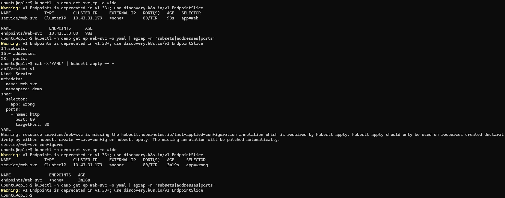

# k3s 교육 실습 랩: Pod 장애 분석 / 서비스 라우팅 / HPA / Ingress(Traefik)

---

# Ingress와 Traefik의 차이 (Kubernetes 관점)

> 한 줄 요약: **Ingress는 “규칙(리소스)”, Traefik은 그 규칙을 실제로 적용해 트래픽을 라우팅하는 “컨트롤러/프록시(구현체)”** 입니다.

---

## 1) Ingress란?

**Ingress**는 Kubernetes의 **리소스(Resource) 오브젝트**로, 클러스터 외부(또는 다른 네트워크)에서 들어오는 HTTP/HTTPS 트래픽을 **어떤 Service로, 어떤 규칙으로** 보낼지 정의합니다.

- 무엇을 정의하나?
  - 호스트 기반 라우팅: `example.com` → `service-a`
  - 경로 기반 라우팅: `/api` → `service-api`, `/web` → `service-web`
  - TLS(HTTPS) 종료: 인증서(secret) 연결
- 무엇을 “하지” 않나?
  - Ingress 자체는 트래픽을 실제로 프록시하지 않습니다.
  - **실제 동작은 Ingress Controller**가 합니다.

즉, Ingress는 “정책/규칙” 문서(선언)이고, 실제로 그걸 실행하는 엔진이 필요합니다.

---

## 2) Traefik이란?

**Traefik**은 (주로) Kubernetes에서 쓰이는 **Ingress Controller(컨트롤러)** 이자 **리버스 프록시/로드밸런서** 입니다.

- Kubernetes API를 감시(watch)하면서
  - `Ingress` / `Service` / `Endpoint` / (선택) `IngressRoute` 같은 리소스를 읽고
- 그 정보를 바탕으로
  - 실제 프록시 라우팅 설정을 동적으로 구성하고
  - 외부 트래픽을 내부 서비스로 전달합니다.

즉, Traefik은 “Ingress 규칙을 실제로 실행하는 구현체”에 해당합니다.

---

## 3) 핵심 차이: 개념 vs 구현

| 구분 | Ingress | Traefik |
|---|---|---|
| 정체 | Kubernetes **리소스(규격/객체)** | Ingress Controller **소프트웨어(프록시)** |
| 역할 | “이 호스트/경로는 이 Service로”라는 **라우팅 규칙 선언** | 그 규칙을 읽고 **실제로 트래픽을 라우팅** |
| 동작 주체 | 혼자선 동작 X (컨트롤러 필요) | 스스로 동작 (컨트롤러/프록시) |
| 범위 | 표준(일반적인 기능 위주) | 제품/프로젝트별 기능 확장 가능 |
| 예 | `kind: Ingress` YAML | Traefik 배포(Deployment/DaemonSet) + 설정/CRD |

**정리:**  
- Ingress = “표준 API 리소스(규칙 문서)”
- Traefik = “그 규칙을 적용하는 컨트롤러/프록시”

---

## 4) Ingress Controller란?

Ingress가 실제로 작동하려면 **Ingress Controller**가 있어야 합니다.

대표적인 Ingress Controller:
- **Traefik**
- NGINX Ingress Controller
- HAProxy Ingress
- Istio/Envoy 기반 Gateway 등(엄밀히는 Ingress 대체/확장)

컨트롤러는 `Ingress` 리소스를 감시하고, 라우팅 설정을 갱신하며, 요청을 프록시합니다.

---

## 5) Traefik이 Ingress “말고도” 하는 것들

Traefik은 Ingress를 지원하는 것 외에도 다양한 기능을 제공합니다(설치/설정에 따라 다름).

- 대시보드(라우팅/서비스 상태 확인)
- 미들웨어(Middleware)
  - 리다이렉트(HTTP→HTTPS)
  - 경로 재작성(Rewrite)
  - BasicAuth / IP allowlist
  - Rate limit 등
- Let’s Encrypt(ACME)로 TLS 자동 발급/갱신(구성 시)
- Kubernetes CRD 기반 확장 리소스 지원
  - `IngressRoute`, `Middleware`, `TLSOption`, `TraefikService` 등

> 표준 Ingress로 표현하기 어려운 세밀한 제어를 Traefik CRD로 제공하는 경우가 많습니다.

---

## 6) 예시: 표준 Ingress로 Traefik에 라우팅 규칙 적용

아래는 **표준 Ingress** YAML입니다.  
Traefik이 Ingress Controller로 동작 중이면, 이 규칙을 읽고 라우팅을 구성합니다.

```yaml
apiVersion: networking.k8s.io/v1
kind: Ingress
metadata:
  name: web-ing
  namespace: default
  annotations:
    kubernetes.io/ingress.class: traefik  # (환경에 따라) traefik이 이 Ingress를 처리하도록 지정
spec:
  rules:
  - host: demo.example.com
    http:
      paths:
      - path: /
        pathType: Prefix
        backend:
          service:
            name: web-svc
            port:
              number: 80
```

- 위 YAML은 “규칙”이고,
- Traefik은 이를 읽어 실제 트래픽을 `web-svc:80`으로 전달합니다.

---

## 7) 예시: Traefik CRD(IngressRoute)로 더 세밀하게

Traefik을 CRD 모드로 쓰면, 아래처럼 **IngressRoute** 리소스를 사용하기도 합니다.

```yaml
apiVersion: traefik.io/v1alpha1
kind: IngressRoute
metadata:
  name: web-route
  namespace: default
spec:
  entryPoints:
    - web
  routes:
    - match: Host(`demo.example.com`) && PathPrefix(`/`)
      kind: Rule
      services:
        - name: web-svc
          port: 80
```

- 표준 Ingress보다 Traefik 고유 기능을 쓰기 쉬운 장점이 있습니다.
- 다만 “표준성”은 낮아져서, 컨트롤러 교체 시 마이그레이션 비용이 늘 수 있습니다.

---

## 8) 언제 Ingress(표준)만 쓰고, 언제 Traefik CRD를 쓰나?

**표준 Ingress 위주(권장 시작점)**
- 단순 호스트/경로 라우팅 + TLS 정도면 충분
- 다른 컨트롤러로 바꿀 가능성이 있음(이식성 중요)
- 팀 표준을 Kubernetes 표준 리소스로 유지하고 싶음

**Traefik CRD까지 활용**
- 미들웨어/인증/리라이트/세밀한 라우팅 정책이 많이 필요
- Traefik 고유 기능(대시보드/동적 설정/옵션)을 적극 활용
- 컨트롤러를 Traefik으로 고정해도 괜찮음

---

## 9) k3s 환경에서 자주 보는 포인트 (실습/교육용)

k3s는 배포 옵션에 따라 **기본 Ingress Controller가 Traefik인 경우가 많습니다.**  
따라서 “Ingress를 만들었는데 잘 된다”면, 뒤에서 Traefik이 동작 중일 확률이 높습니다.

확인 예시:
```bash
kubectl -n kube-system get pods | grep -i traefik
kubectl get ingress -A
kubectl describe ingress -A
```

---

## 10) 자주 헷갈리는 질문 정리

### Q1. “Ingress가 있으면 Traefik은 없어도 되나요?”
아니요. **Ingress는 규칙일 뿐이라**, 반드시 이를 처리하는 **Ingress Controller(예: Traefik, NGINX 등)** 가 필요합니다.

### Q2. “Traefik을 쓰면 Ingress를 안 써도 되나요?”
가능은 합니다. Traefik CRD(`IngressRoute`)를 쓰면 표준 Ingress 없이도 라우팅을 정의할 수 있습니다.  
다만 표준성과 이식성을 생각하면 **Ingress부터 시작**하는 경우가 많습니다.

### Q3. “Ingress vs LoadBalancer vs NodePort 관계는?”
- **Ingress**: L7(HTTP/HTTPS) 라우팅 규칙
- **Service NodePort/LoadBalancer**: L4 수준에서 외부 접근 경로 제공(포트/로드밸런서)
- 실제 현장에선 보통:
  - 외부 → (LoadBalancer/NodePort) → Ingress Controller(Traefik) → Service → Pod

---

## 11) 체크리스트(문제 발생 시)

- Ingress Controller가 떠 있나?
  - `kubectl -n kube-system get pods | grep -i traefik`
- IngressClass / annotation 지정이 맞나?
  - 환경에 따라 `ingressClassName` 또는 annotation 필요
- Service/Port가 맞나?
  - backend service name, port number 확인
- DNS/Host가 맞나?
  - `Host` 기반이면 실제 요청 Host 헤더가 일치해야 함
- TLS secret/인증서가 맞나?
  - `kubectl get secret -n <ns>`

---

## 결론

- **Ingress**: Kubernetes 표준 리소스로 “라우팅 규칙”을 선언한다.
- **Traefik**: 그 규칙을 읽어 실제로 트래픽을 프록시하는 “Ingress Controller/리버스 프록시”다.

둘은 경쟁 관계가 아니라, 보통은 **Ingress(규칙)** + **Traefik(실행 엔진)** 처럼 함께 사용됩니다.

---


> 대상: k3s 클러스터(기본 Traefik), 교육/실습용  
> 목표: **일부러 문제를 만들고 → 진단 → 해결**까지 “손에 익는” 흐름으로 반복

---

## 0) 실습 공통 준비

### 0-1. 네임스페이스 생성
```sh
kubectl create ns demo
```
(이미 있으면 에러 나도 무시 OK)

### 0-2. 기본 앱 배포(nginx) + 서비스
```sh
kubectl -n demo create deploy web --image=nginx:1.27-alpine
kubectl -n demo expose deploy web --port=80 --target-port=80 --name=web-svc
kubectl -n demo get deploy,pod,svc -o wide
```
---
```
ubuntu@cp1:~$ kubectl create ns demo
namespace/demo created
ubuntu@cp1:~$ kubectl -n demo create deploy web --image=nginx:1.27-alpine
deployment.apps/web created
ubuntu@cp1:~$ kubectl -n demo expose deploy web --port=80 --target-port=80 --name=web-svc
service/web-svc exposed
ubuntu@cp1:~$ kubectl -n demo get deploy,pod,svc -o wide
NAME                  READY   UP-TO-DATE   AVAILABLE   AGE   CONTAINERS   IMAGES              SELECTOR
deployment.apps/web   1/1     1            1           23s   nginx        nginx:1.27-alpine   app=web

NAME                       READY   STATUS    RESTARTS   AGE   IP          NODE   NOMINATED NODE   READINESS GATES
pod/web-79ffc79c64-wgc5c   1/1     Running   0          23s   10.42.1.8   w1     <none>           <none>

NAME              TYPE        CLUSTER-IP     EXTERNAL-IP   PORT(S)   AGE   SELECTOR
service/web-svc   ClusterIP   10.43.31.179   <none>        80/TCP    11s   app=web
ubuntu@cp1:~$
```
---

### 0-3. 편의 변수(선택)
```sh
NS=demo
APP=web
SVC=web-svc
```
---
```
ubuntu@cp1:~$ NS=demo
ubuntu@cp1:~$ echo $NS
demo
```

---

## 1) LAB-01: Service 라우팅 장애(Endpoints 비어있음) 만들기 & 해결하기
> 핵심 학습: **Service selector ↔ Pod label 불일치** → Endpoints 없음 → 접속 실패

### 1-A. 정상 상태 확인(Endpoints가 존재해야 함)
```sh
kubectl -n demo get svc,ep -o wide
```
---
ubuntu@cp1:~$ kubectl -n demo get svc,ep -o wide
Warning: v1 Endpoints is deprecated in v1.33+; use discovery.k8s.io/v1 EndpointSlice
NAME              TYPE        CLUSTER-IP     EXTERNAL-IP   PORT(S)   AGE   SELECTOR
service/web-svc   ClusterIP   10.43.31.179   <none>        80/TCP    98s   app=web

NAME                ENDPOINTS      AGE
endpoints/web-svc   10.42.1.8:80   98s

---

```
kubectl -n demo get ep web-svc -o yaml | egrep -n 'subsets|addresses|ports'
```
---
```
ubuntu@cp1:~$ kubectl -n demo get ep web-svc -o yaml | egrep -n 'subsets|addresses|ports'
Warning: v1 Endpoints is deprecated in v1.33+; use discovery.k8s.io/v1 EndpointSlice
14:subsets:
15:- addresses:
23:  ports:
```

### 1-B. 장애 만들기: Service selector를 일부러 틀리게 바꾸기
아래 YAML로 **selector를 app=wrong**으로 변경합니다.
```sh
cat <<'YAML' | kubectl apply -f -
apiVersion: v1
kind: Service
metadata:
  name: web-svc
  namespace: demo
spec:
  selector:
    app: wrong
  ports:
    - name: http
      port: 80
      targetPort: 80
YAML
```
---
```
ubuntu@cp1:~$ cat <<'YAML' | kubectl apply -f -
apiVersion: v1
kind: Service
metadata:
  name: web-svc
  namespace: demo
spec:
  selector:
    app: wrong
  ports:
    - name: http
      port: 80
      targetPort: 80
YAML
Warning: resource services/web-svc is missing the kubectl.kubernetes.io/last-applied-configuration annotation which is required by kubectl apply. kubectl apply should only be used on resources created declaratively by either kubectl create --save-config or kubectl apply. The missing annotation will be patched automatically.
service/web-svc configured
```
---

### 1-C. 증상 확인
```sh
kubectl -n demo get svc,ep -o wide
kubectl -n demo get ep web-svc -o yaml | egrep -n 'subsets|addresses|ports'
```


- 기대 결과: **Endpoints가 비어 있음**

클러스터 내부에서 curl 테스트(실패해야 정상)
```sh
kubectl run -n demo tmp --rm -it --image=curlimages/curl -- sh -lc "curl -sv http://web-svc:80/ 2>&1 | head -n 40"
```
---
```
ubuntu@cp1:~$ kubectl run -n demo tmp --rm -it --image=curlimages/curl -- sh -lc "curl -sv http://web-svc:80/ 2>&1 | head -n 40"
Error from server (AlreadyExists): pods "tmp" already exists
```
---
```
ubuntu@cp1:~$ kubectl run -n demo tmp --rm -it --image=curlimages/curl -- sh -lc "curl -sS http://web-svc:80/ | head"
Error from server (AlreadyExists): pods "tmp" already exists

ubuntu@cp1:~$ kubectl -n demo delete pod tmp --force --grace-period=0
Warning: Immediate deletion does not wait for confirmation that the running resource has been terminated. The resource may continue to run on the cluster indefinitely.
pod "tmp" force deleted from demo namespace
ubuntu@cp1:~$ kubectl -n demo get pod tmp
Error from server (NotFound): pods "tmp" not found
```

### 위의 과정 다시
```
ubuntu@cp1:~$ cat <<'YAML' | kubectl apply -f -
apiVersion: v1
kind: Service
metadata:
  name: web-svc
  namespace: demo
spec:
  selector:
    app: wrong
  ports:
    - name: http
      port: 80
      targetPort: 80
YAML
service/web-svc configured
ubuntu@cp1:~$ kubectl -n demo get ep web-svc -o wide
Warning: v1 Endpoints is deprecated in v1.33+; use discovery.k8s.io/v1 EndpointSlice
NAME      ENDPOINTS   AGE
web-svc   <none>      12m
```
---


### 1-D. 원인 진단(정답 루트)
```sh
kubectl -n demo get svc web-svc -o jsonpath='{.spec.selector}'; echo
```
---

```sh
ubuntu@cp1:~$ kubectl -n demo get svc web-svc -o jsonpath='{.spec.selector}'; echo
{"app":"wrong"}
```
---

```sh
kubectl -n demo get pod --show-labels
```
---

```sh
ubuntu@cp1:~$ kubectl -n demo get pod --show-labels
NAME                   READY   STATUS             RESTARTS      AGE     LABELS
tmp                    0/1     CrashLoopBackOff   3 (49s ago)   106s    run=tmp
web-79ffc79c64-wgc5c   1/1     Running            0             6m17s   app=web,pod-template-hash=79ffc79c64
```
---
### 1-E. 해결: Service selector를 원래대로(app=web) 복구
```sh
cat <<'YAML' | kubectl apply -f -
apiVersion: v1
kind: Service
metadata:
  name: web-svc
  namespace: demo
spec:
  selector:
    app: web
  ports:
    - name: http
      port: 80
      targetPort: 80
YAML
```

### 1-F. 해결 검증
```sh
kubectl -n demo get ep web-svc -o wide
kubectl run -n demo tmp --rm -it --image=curlimages/curl -- sh -lc "curl -sS http://web-svc:80/ | head"
```
---
```
ubuntu@cp1:~$ kubectl -n demo get ep web-svc -o wide
Warning: v1 Endpoints is deprecated in v1.33+; use discovery.k8s.io/v1 EndpointSlice
NAME      ENDPOINTS   AGE
web-svc   <none>      12m
ubuntu@cp1:~$ cat <<'YAML' | kubectl apply -f -
apiVersion: v1
kind: Service
metadata:
  name: web-svc
  namespace: demo
spec:
  selector:
    app: web
  ports:
    - name: http
      port: 80
      targetPort: 80
YAML
service/web-svc configured
ubuntu@cp1:~$ kubectl -n demo get ep web-svc -o wide
Warning: v1 Endpoints is deprecated in v1.33+; use discovery.k8s.io/v1 EndpointSlice
NAME      ENDPOINTS      AGE
web-svc   10.42.1.8:80   14m
```

---

## 2) LAB-02: Pod CrashLoopBackOff 만들기 & 해결하기
> 핵심 학습: **describe 이벤트 → logs/previous → exec로 내부 확인**

---
# Pod CrashLoopBackOff 정리 (원인·진단·해결)

> 한 줄 요약: **컨테이너가 반복적으로 “시작 → 즉시 종료(크래시)”를 하자, kubelet이 재시작 간격을 점점 늘리며(backoff) 재시도하는 상태**가 `CrashLoopBackOff` 입니다.

---

## 1) CrashLoopBackOff란?

- Kubernetes에서 Pod 안의 **컨테이너가 계속 실패(비정상 종료)하여 재시작을 반복**할 때 나타나는 상태입니다.
- “BackOff”는 **재시작을 바로바로 하지 않고 점점 대기 시간을 늘리는(지수형 backoff) 동작**을 의미합니다.
- 즉,
  - 컨테이너가 죽음 → (restartPolicy에 따라) kubelet이 재시작 시도 → 또 죽음 → 재시작 간격 증가 → `CrashLoopBackOff`

---

## 2) 어떻게 발생하나? (대표 원인)

### A. 애플리케이션이 즉시 종료됨
- 프로세스가 실행되자마자 끝나는 경우(예: 배치 커맨드를 잘못 구성, 데몬이 아님)
- 엔트리포인트/커맨드 오류 (`command`/`args` 잘못 지정)

### B. 설정/환경 문제
- 환경변수 누락, 설정 파일 경로 오류
- Secret/ConfigMap 값 누락 또는 잘못된 키

### C. 의존성 연결 실패
- DB/Redis/외부 API 접속 실패 시 즉시 종료하도록 구현되어 있음
- DNS 문제, 네트워크 정책/방화벽 차단

### D. 파일/권한 문제
- 마운트 경로/파일 권한(읽기/쓰기) 오류
- 실행 권한 없음(예: 쉘 스크립트 `Permission denied`)

### E. 리소스 문제 - OOM(Out Of Memory)
- **OOMKilled(메모리 부족)** 로 종료 → 재시작 반복
- CPU/메모리 제한이 너무 낮아 초기 부팅 중 종료

# F. 프로브(Probe) 실패로 재시작 --> 7.2 내용 참고
- `livenessProbe`가 계속 실패해서 kubelet이 컨테이너를 죽이고 재시작
- (주의) readinessProbe는 “트래픽 제외”이지 보통 “재시작”은 아닙니다. 재시작은 주로 liveness/startupProbe 실패가 원인.

---

## 3) 실습에서 자주 보는 케이스 (kubectl run 임시 Pod)

`kubectl run -it --rm ...`로 만든 임시 Pod에서:
- 서비스 Endpoint가 없어서 `curl`이 오래 대기하다가
- `^C`로 끊거나 컨테이너가 비정상 종료하면
- Pod가 **깨끗하게 삭제되지 않고 남거나**, **재시작**하면서 CrashLoop처럼 보일 수 있습니다.

---

## 4) 진단: “무엇이 죽이는가?” 빠르게 찾는 순서

### Step 1) Pod 이벤트부터 보기 (가장 중요)
```bash
kubectl -n <ns> describe pod <pod>
```
아래 키워드를 찾습니다:
- `Back-off restarting failed container`
- `Error`, `Exit Code`, `OOMKilled`
- 이미지 풀 실패(`ImagePullBackOff`)는 CrashLoop와 다름(아예 실행을 못함)

### Step 2) 현재/이전 로그 확인
CrashLoop는 “재시작”이므로 **직전 실행 로그**가 중요합니다.
```bash
kubectl -n <ns> logs <pod> -c <container>
kubectl -n <ns> logs <pod> -c <container> --previous
```

### Step 3) 종료 코드(Exit Code) 확인
```bash
kubectl -n <ns> get pod <pod> -o jsonpath='{.status.containerStatuses[0].lastState.terminated.exitCode}'; echo
kubectl -n <ns> get pod <pod> -o jsonpath='{.status.containerStatuses[0].lastState.terminated.reason}'; echo
```

### Step 4) 리소스/OOM 확인
```bash
kubectl -n <ns> describe pod <pod> | egrep -i 'oom|killed|memory|cpu|limit|request'
kubectl top pod -n <ns>
```

### Step 5) 프로브 확인
```bash
kubectl -n <ns> get pod <pod> -o yaml | egrep -n 'livenessProbe|readinessProbe|startupProbe'
kubectl -n <ns> describe pod <pod> | egrep -n 'Liveness|Readiness|Startup|probe|Unhealthy'
```

---

## 5) 해결 패턴(원인별 처방)

### A. 커맨드/엔트리포인트 문제
- `command/args` 오타, 실행 파일 경로 확인
- 컨테이너 안에서 직접 실행 확인:
```bash
kubectl -n <ns> exec -it <pod> -- sh
# 또는 (Pod가 바로 죽어 exec가 안 되면) 이미지로 별도 디버그 Pod 실행
kubectl -n <ns> run debug --rm -it --restart=Never --image=<image> -- sh
```

### B. 환경변수/ConfigMap/Secret 문제
- 누락 여부 점검:
```bash
kubectl -n <ns> get cm,secret
kubectl -n <ns> describe deploy/<name>
```
- 앱이 “설정 없으면 즉시 종료”하는지 코드/설정 확인

### C. 의존 서비스 연결 실패
- 서비스 DNS/포트 확인:
```bash
kubectl -n <ns> get svc,ep
kubectl -n <ns> run net --rm -it --restart=Never --image=curlimages/curl -- sh -lc \
"nslookup <svc> && curl -sv http://<svc>:<port>/ 2>&1 | head"
```

### D. OOMKilled(메모리 부족)
- limits/requests 조정, 앱 메모리 사용량 최적화
- 임시로 limit 상향 후 재현 여부 확인

### E. livenessProbe 실패
- startup 시간이 긴 앱이면:
  - `startupProbe` 도입
  - livenessProbe `initialDelaySeconds`, `failureThreshold`, `timeoutSeconds` 완화
- 실제로 “앱이 살아있는데” 프로브가 너무 빡빡하면 계속 재시작됩니다.

---

## 6) CrashLoopBackOff vs 비슷한 상태들

| 상태 | 의미 | 핵심 |
|---|---|---|
| CrashLoopBackOff | 실행은 되지만 계속 죽어서 재시작/백오프 | **Exit code/로그/이벤트** 봐야 함 |
| ImagePullBackOff | 이미지 풀 실패 | 레지스트리/태그/인증 문제 |
| ErrImagePull | 이미지 다운로드 자체 실패 | 동일 |
| CreateContainerConfigError | 설정 문제로 컨테이너 생성 불가 | env/secret/volume 등 |
| RunContainerError | 런타임 레벨 에러 | 노드/런타임 로그 필요 |

---

## 7) 실습용 “재현” 예시(이해를 위한)

### (1) 즉시 종료되는 컨테이너 → CrashLoop
```bash
kubectl -n demo run crash --image=busybox --restart=Always -- sh -lc "exit 1"
kubectl -n demo get pod crash -w
kubectl -n demo describe pod crash
kubectl -n demo logs crash --previous
```

---

## 8) “바로 해결” 체크리스트

1. `kubectl describe pod`에서 **Events** 확인  
2. `kubectl logs --previous`로 **직전 로그** 확인  
3. `ExitCode / Reason(OOMKilled 등)` 확인  
4. 프로브/리소스/설정/의존성 중 어디 문제인지 분류  
5. 수정 후 재배포(`kubectl rollout restart deploy/<name>`) 또는 Pod 재생성  

---

## 9) (당신 실습 로그 기준) 핵심 포인트

- `kubectl run ... tmp`가 `AlreadyExists`로 막힌 것은 **tmp Pod가 이미 남아있기 때문**입니다.
- CrashLoopBackOff 상태의 임시 Pod는 아래처럼 정리하는 게 깔끔합니다:
```bash
kubectl -n demo delete pod tmp --force --grace-period=0
kubectl -n demo run --rm -it --restart=Never --image=curlimages/curl curltest- -- sh -lc \
"curl -sS http://web-svc:80/ | head"
```

---

## 결론

`CrashLoopBackOff`는 “앱(컨테이너)이 계속 죽는다”는 신호입니다.  
가장 빠른 해결은 **Events + --previous 로그 + 종료코드** 3가지를 보고 원인을 좁히는 것입니다.

---

### 2-A. 장애 만들기: 존재하지 않는 명령으로 컨테이너 시작
(컨테이너가 바로 죽어서 CrashLoopBackOff 발생)
```sh
cat <<'YAML' | kubectl apply -f -
apiVersion: apps/v1
kind: Deployment
metadata:
  name: crash-app
  namespace: demo
spec:
  replicas: 1
  selector:
    matchLabels:
      app: crash-app
  template:
    metadata:
      labels:
        app: crash-app
    spec:
      containers:
        - name: app
          image: busybox:1.36
          command: ["sh","-lc","not-a-real-command"]
YAML
```

### 2-B. 증상 확인
```sh
kubectl -n demo get pod -l app=crash-app -w
```
(잠깐 기다리면 STATUS가 CrashLoopBackOff로 변함)

### 2-C. 원인 진단 루틴(실전 순서)
1) Events(가장 빠름)
```sh
POD=$(kubectl -n demo get pod -l app=crash-app -o jsonpath='{.items[0].metadata.name}')
kubectl -n demo describe pod "$POD" | egrep -n 'Events|Warning|Back-off|Failed|Error'
```

2) logs / previous
```sh
kubectl -n demo logs "$POD" --tail=200
kubectl -n demo logs "$POD" --previous --tail=200
```

### 2-D. 해결: 정상 command로 변경(무한 대기)
```sh
cat <<'YAML' | kubectl apply -f -
apiVersion: apps/v1
kind: Deployment
metadata:
  name: crash-app
  namespace: demo
spec:
  replicas: 1
  selector:
    matchLabels:
      app: crash-app
  template:
    metadata:
      labels:
        app: crash-app
    spec:
      containers:
        - name: app
          image: busybox:1.36
          command: ["sh","-lc","echo ok; sleep 3600"]
YAML
```

### 2-E. 해결 검증
```sh
kubectl -n demo get pod -l app=crash-app -w
kubectl -n demo logs -l app=crash-app --tail=50
```

---

## 3) LAB-03: HPA 실습(사전 조건 점검 → 부하 → 스케일)
> 주의: k3s는 환경에 따라 metrics-server가 없을 수 있습니다.  
> **HPA/`kubectl top`이 안 되면 먼저 metrics부터.**

### 3-A. metrics API 동작 확인
```sh
kubectl get apiservices | grep metrics
kubectl top node 2>&1 | head
```
- `kubectl top`이 에러면: metrics-server가 없거나 동작 문제가 있을 수 있음

#### (선택) metrics-server 존재/로그 점검
```sh
kubectl -n kube-system get deploy | grep metrics
kubectl -n kube-system logs deploy/metrics-server --tail=200 | egrep -i 'error|fail|x509|timeout'
```

### 3-B. HPA 대상 앱 준비(요청량 requests 설정 포함)
```sh
cat <<'YAML' | kubectl apply -f -
apiVersion: apps/v1
kind: Deployment
metadata:
  name: hpa-app
  namespace: demo
spec:
  replicas: 1
  selector:
    matchLabels:
      app: hpa-app
  template:
    metadata:
      labels:
        app: hpa-app
    spec:
      containers:
      - name: app
        image: nginx:1.27-alpine
        ports:
        - containerPort: 80
        resources:
          requests:
            cpu: "50m"
            memory: "64Mi"
          limits:
            cpu: "200m"
            memory: "128Mi"
---
apiVersion: v1
kind: Service
metadata:
  name: hpa-svc
  namespace: demo
spec:
  selector:
    app: hpa-app
  ports:
  - port: 80
    targetPort: 80
YAML
```

### 3-C. HPA 생성(예: CPU 50% 목표)
```sh
kubectl -n demo autoscale deploy hpa-app --cpu-percent=50 --min=1 --max=5
kubectl -n demo get hpa
```

### 3-D. 부하 생성(내부에서 반복 요청)
```sh
kubectl run -n demo load --rm -it --image=busybox:1.36 -- sh -lc \
"while true; do wget -qO- http://hpa-svc:80/ >/dev/null; done"
```

다른 터미널에서 스케일 추적
```sh
kubectl -n demo get hpa -w
kubectl -n demo get pod -l app=hpa-app -w
```

### 3-E. 해석 포인트(교육용)
- **requests가 없으면** CPU 기반 HPA가 이상하게 동작/불가능할 수 있음
- 스케일은 즉시가 아니라 metrics 수집 주기/안정화에 따라 지연될 수 있음
- 부하를 끊으면 scale down은 더 느리게(안정화) 일어나는 게 일반적

---

## 4) LAB-04: Ingress(Traefik) 404/라우팅 문제 만들기 & 해결하기
> k3s 기본 Traefik 가정  
> 핵심 학습: **Host 헤더 기반 라우팅**, **Ingress → Service → Endpoints**로 내려가는 디버깅

### 4-A. Traefik 동작 확인
```sh
kubectl -n kube-system get pod | grep traefik
kubectl -n kube-system get svc | grep traefik
```

### 4-B. (사전) Ingress가 가리킬 서비스 준비
LAB-00에서 만든 `web-svc`를 사용합니다.
```sh
kubectl -n demo get svc web-svc -o wide
```

### 4-C. 장애 만들기: Host를 지정해놓고 Host 헤더 없이 접속하기(→ 404)
Ingress 생성(Host: `demo.local`)
```sh
cat <<'YAML' | kubectl apply -f -
apiVersion: networking.k8s.io/v1
kind: Ingress
metadata:
  name: web-ing
  namespace: demo
spec:
  rules:
  - host: demo.local
    http:
      paths:
      - path: /
        pathType: Prefix
        backend:
          service:
            name: web-svc
            port:
              number: 80
YAML
```

Ingress 확인
```sh
kubectl -n demo get ingress
kubectl -n demo describe ingress web-ing | egrep -n 'Rules|Host|Path|Backend|Events'
```

### 4-D. Traefik 서비스 노출 방식 확인(NodePort가 흔함)
```sh
kubectl -n kube-system get svc traefik -o wide
kubectl -n kube-system describe svc traefik | egrep -n 'Type:|NodePort|LoadBalancer|Ports'
```

> 아래에서 `<NODEIP>`는 노드 IP(예: k3s 서버 IP), `<NODEPORT>`는 traefik의 80 포트 NodePort를 넣으세요.

### 4-E. “Host 헤더 없이” 접속(의도적으로 404가 나오는지 확인)
```sh
curl -i "http://<NODEIP>:<NODEPORT>/" | head -n 30
```

### 4-F. 해결: Host 헤더를 넣어 접속(정상 라우팅)
```sh
curl -i -H "Host: demo.local" "http://<NODEIP>:<NODEPORT>/" | head -n 30
```

### 4-G. 502/504가 뜬다면(백엔드 문제) → 아래로 내려가며 점검
1) Service/Endpoints
```sh
kubectl -n demo get svc,ep -o wide
```
2) Pod 상태/Readiness
```sh
kubectl -n demo get pod -o wide
kubectl -n demo describe pod -l app=web | egrep -n 'Ready|Readiness|probe|Events'
```
3) Traefik 로그(힌트 찾기)
```sh
kubectl -n kube-system logs -l app.kubernetes.io/name=traefik --tail=200 | egrep -i 'error|warn|service|router|timeout'
```

---

## 5) 정리: “K8s vs Linux” 구분 포인트(실습 관찰용)

- `kubectl get/describe/logs/exec/apply` → **K8s API(클러스터 리소스)**
- `| grep/egrep/awk/sort/head/tail` → **Linux 쉘(출력 텍스트 가공)**
- `kubectl exec POD -- <cmd>` 의 `<cmd>` → **Pod 내부 Linux**
- `curl`/`wget` → **네트워크 테스트(Linux)**  
  - Ingress는 특히 `-H "Host: ..."`가 핵심

---

## 6) 실습 리셋/정리(원할 때)
```sh
kubectl delete ns demo
```
(전부 삭제 후 재시작)

